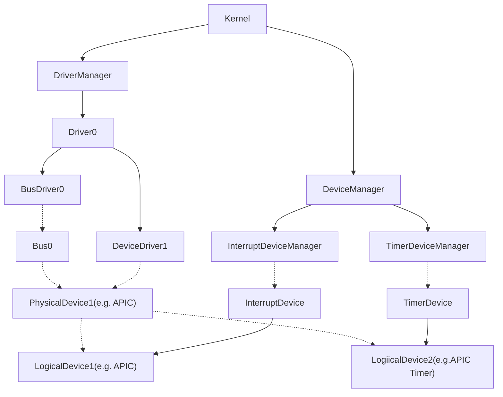
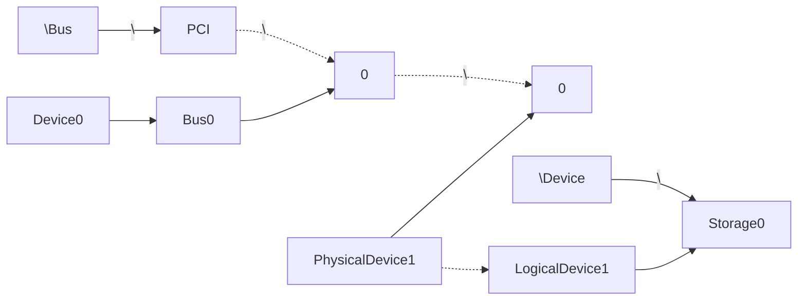
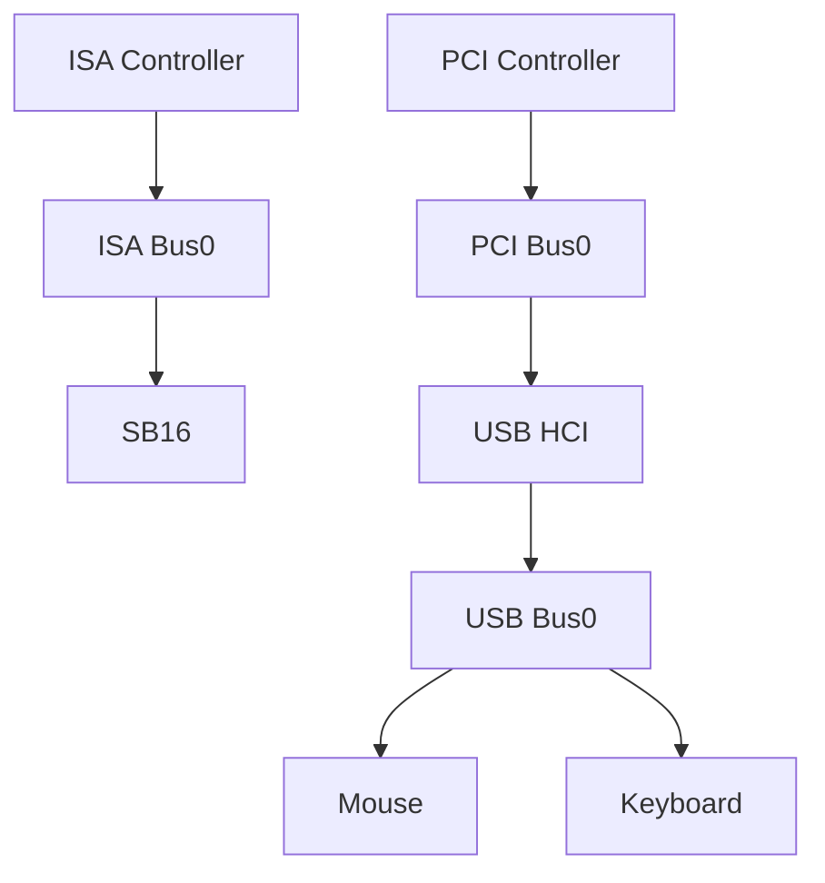
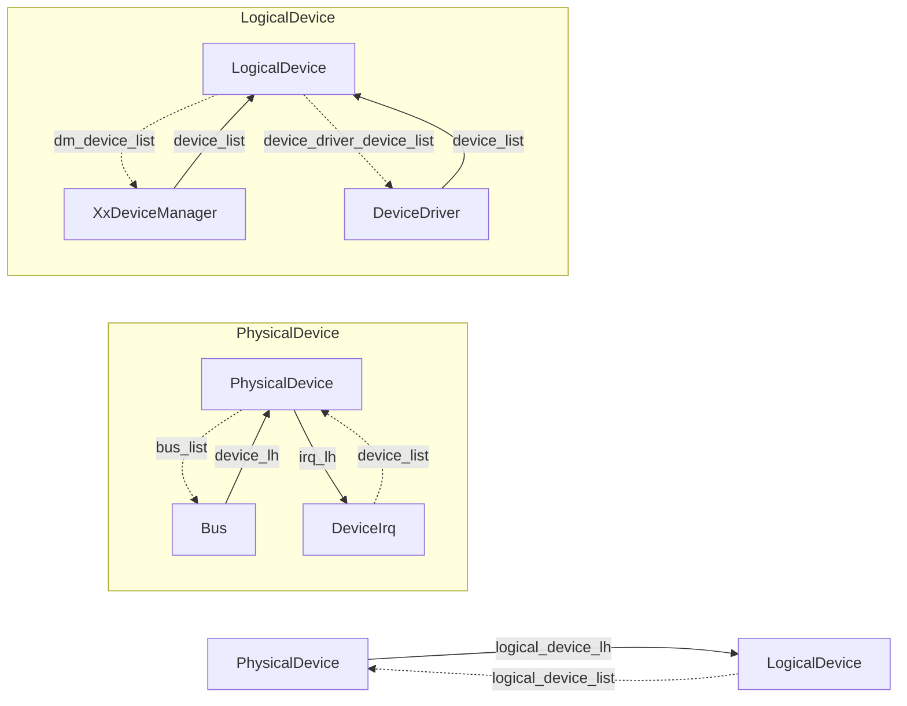

# 关系图

## 总览

所有驱动框架下驱动及设备相关结构之间的关系如下(以APIC为例)：



通过`Object`系统可访问的`PhysicalDevice`和`LogicalDevice`的关系如下：



总线-设备的包含关系如下：



## 链表




# 结构体

## Driver

`Driver`结构描述一个驱动集合，类似于Windows中用户直接下载的驱动

```c
typedef struct Driver {
	string_t short_name;
	list_t	 device_driver_lh;
	list_t	 remapped_memory_lh;

	DriverState state;
} Driver;
```

- `short_name`: 暂时无用
- `device_driver_lh`: 链表，存储`Driver`下注册的所有`DeviceDriver`
- `remapped_memory_lh`: 链表，存储`Driver`下所有驱动程序重映射的内存，方便检查是否重复映射同一片内存和在销毁时释放

## BusDriver

## BusType

```c
typedef enum BusType {
	BUS_TYPE_PLATFORM,
	BUS_TYPE_PCI,
	BUS_TYPE_ISA,
	BUS_TYPE_USB,
	BUS_TYPE_MAX,
} BusType;
```

目前支持4种Bus类型，

- `BUS_TYPE_PLATFORM`: 所有通过固定配置发现的设备都挂到`platform_bus`下，如`pic`/`pit`这类设备
- `BUS_TYPE_PCI`: PCI总线，没什么好说的。在x86中，PCI控制器通过特定IO端口直接访问，所以挂在`platform_bus`下
- `BUS_TYPE_ISA`: ISA总线，目前已有驱动的只有一个`Sound Blaster 16`设备属于ISA总线
- `BUS_TYPE_USB`: USB总线，需要注意的是USB主机控制器接口(Host Controller Interface, HCI)不属于USB总线，因为控制器自身是一个独立的设备挂在其他总线下，如`XHCI`(USB3.x)/`EHCI`(USB2.0)/`UHCI`(USB1.x)/`OHCI`(USB1.x)这些HCI在PC中都是通过PCI总线发现的，所以属于PCI总线

### BusDriver

```c
typedef struct BusDriver {
	list_t		bus_lh;
	string_t	name;
	BusType		bus_type;
	DriverState state;

	Object *object;

	uint16_t new_bus_num;
	uint16_t bus_count;
} BusDriver;
```

- `bus_lh`: 链表，保存这一类型总线下的所有具体的`Bus`
- `name`: 仅用于寻址，如果为`"PCI"`则可直接通过`\Bus\PCI\x\y`寻址到总线下的`PhysicalDevice`
- `bus_type`: 总线类型
- `state`: 驱动状态，主要用于总线下设备驱动注册时先检查总线驱动是否初始化完成
- `object`: 可被寻址的结构，`name`为`"PCI"`时则对应路径`\Bus\PCI`
- `new_bus_num`: 用于分配新创建的`Bus`的编号，对应路径`\Bus\PCI\x\y`中的`x`
- `bus_count`: 统计`Bus`的数量

### Bus

```c
typedef struct Bus {
	list_t	   device_lh;
	list_t	   bus_list;
	list_t	   bus_check_list;
	list_t	   new_bus_list;
	BusDriver *bus_driver;

	struct Bus *primary_bus;

	Object	*object;

	uint32_t bus_num;
	uint32_t subordinate_bus_num;

	int new_device_num;
	int device_count;

	BusOps *ops;
} Bus;
```

- `device_lh`: 链表，保存总线下所有设备
- `bus_list`: 连接到`BusDriver`中的`bus_lh`
- `bus_check_list`: 连接到`driver.c`中的`bus_check_lh`，用于启动后持续检测总线设备连接情况，目前仅USB使用
- `new_bus_list`: 由`register_bus_driver`添加到`driver.c`的`new_bus_lh`中，用于启动时遍历所有总线并初始化
- `bus_driver`: 对应的`BusDriver`
- `primary_bus`: 父总线，如果没有则为`NULL`
- `object`: `bus`对应的`Object`，对应路径`\Bus\PCI\x\y`中的`x` `Object`
- `bus_num`: `bus`的编号，在`create_bus`时分配，对应路径`\Bus\PCI\x\y`中的`x`的数值
- `subordinate_bus_num`: 子`Bus`的起始编号
- `new_device_num`: 用于分配总线下新设备的编号，对应路径`\Bus\PCI\x\y`中的`y`
- `device_count`: 统计总线下设备的总数
- `ops`: 每个`Bus`的操作接口

### BusOps

```c
typedef struct BusOps {
	DriverResult (*scan_bus)(struct BusDriver *bus_driver, struct Bus *bus);
	DriverResult (*probe_device)(struct BusDriver *bus_driver, struct Bus *bus);
} BusOps;
```

- `scan_bus`: 扫描总线下存在的设备
- `probe_device`: 探测总线下所有的设备，并为其匹配驱动

## DeviceDriver

### DeviceDriver

```c
typedef struct DeviceDriver {
	list_t device_driver_list;
	list_t device_lh;
} DeviceDriver;
```

- `device_driver_list`: 连接到`Driver`的`device_driver_lh`
- `device_lh`: 链表，保存该`DeviceDriver`驱动的所有设备

## Device

### DeviceKind

```c
typedef enum DeviceKind {
	DEVICE_KIND_PHYSICAL,
	DEVICE_KIND_LOGICAL,
} DeviceKind;
```

用于区分`PhysicalDevice`和`LogicalDevice`类型

### DeviceState

```c
typedef enum {
	DEVICE_STATE_UNINIT, // 设备未初始化
	DEVICE_STATE_READY,	 // 设备准备就绪
	DEVICE_STATE_ACTIVE, // 设备正在运行
	DEVICE_STATE_ERROR,	 // 设备错误
} DeviceState;
```

### DeviceOps

```c
typedef struct DeviceOps {
	DriverResult (*init)(void *device);	   // 初始化设备
	DriverResult (*start)(void *device);   // 启动设备
	DriverResult (*stop)(void *device);	   // 停止设备
	DriverResult (*destroy)(void *device); // 销毁设备
} DeviceOps;
```

`PhysicalDevice`和`LogicalDevice`通用，所以使用`void *`类型

### PhysicalDevice

```c
typedef struct PhysicalDevice {
	DeviceKind	kind;
	DeviceState state;
	list_t		new_device_list;

	list_t bus_list;
	list_t logical_device_lh;
	list_t irq_lh;

	int num;

	struct Bus *bus;

	struct Object *object;

	DeviceOps *ops;

	void *private_data;
	void *bus_ext;
} PhysicalDevice;
```

`PhysicalDevice`一般对应真实存在的设备（或芯片），一般在总线探测设备时直接创建，设备驱动需要使用`register_physical_device`才不会在初始化设备时忽略这个设备。如果不是由总线发现时则需要驱动自行调用`create_physical_device`创建

- `kind`: 标识设备种类（`PhysicalDevice`/`LogicalDevice`），与`LogicalDevice`头部保持一致，所以可以先假设类型再判断
- `state`: 标识设备状态，其余同上
- `new_device_list`: 连接到`new_device_lh`，其余同上
- `bus_list`: 连接到`Bus`的`device_lh`
- `logical_device_lh`: 链表，保存`PhysicalDevice`对应的所有`LogicalDevice`
- `irq_lh`: 暂未使用，计划用于删除`PhysicalDevice`时注销该设备所有已注册的`DeviceIrq`
- `num`: 该设备在总线下的设备编号，对应路径`\Bus\PCI\x\y`中的`y`的数值
- `bus`: 该设备所在的`Bus`
- `object`: 对应路径`\Bus\PCI\x\y`指向的`Object`
- `ops`: 设备通用的操作接口，由具体的设备驱动通过`register_physical_device`设置
- `private_data`: 驱动自行保存的信息
- `bus_ext`: 由总线保存的总线相关信息

### DeviceType

```c
typedef enum {
	DEVICE_TYPE_UNKNOWN = 0,		      // 未知设备类型
	DEVICE_TYPE_INTERRUPT_CONTROLLER, // 中断控制器
	DEVICE_TYPE_TIMER,				        // 定时器设备
	DEVICE_TYPE_FRAMEBUFFER,		      // 通过显示缓冲区直接控制的屏幕
	DEVICE_TYPE_STORAGE,			        // 存储设备（如硬盘）
	DEVICE_TYPE_INPUT,				        // 输入设备（如键盘鼠标）
	DEVICE_TYPE_SOUND,				        // 声音设备（声卡）
	DEVICE_TYPE_BUS_CONTROLLER,       // 总线控制器（如usb控制器XHCI/EHCI/OHCI/UHCI）
	DEVICE_TYPE_INTERNET,		          // 网络设备（网卡）
	DEVICE_TYPE_TIME,			            // 时间设备（如：Unix时间戳/UTC时间）
	DEVICE_TYPE_SERIAL,			          // 串口设备
	DEVICE_TYPE_MAX,
} DeviceType;
```

只在`LogicalDevice`中使用，用于标识`LogicalDevice`对应的设备的功能

需要注意的是USB设备不单独作为类型在`DeviceType中`，USB设备根据其具体的功能选择`DeviceType`

### LogicalDevice

```c
typedef struct LogicalDevice {
	DeviceKind	kind;
	DeviceState state;
	list_t		new_device_list;

	list_t logical_device_list;
	list_t dm_device_list;
	list_t device_driver_device_list;

	DeviceType type;
	DeviceOps *ops;

	struct PhysicalDevice *physical_device;
	struct Object		  *object;
	void				  *dm_ext; // 设备管理器所需的扩展信息

	void *private_data;
} LogicalDevice;
```

`LogicalDevice`根据具体的功能来划分，一个`PhysicalDevice`可以创建多个`LogicalDevice`，一般通过对应`DeviceManager`的接口隐式创建，如果是未知设备类型需要手动调用`create_logical_device`创建

- `kind`: 同上
- `state`: 同上
- `new_device_list`: 同上
- `logical_device_list`: 连接到`PhysicalDevice`的`logical_device_lh`
- `dm_device_list`: 连接到`DeviceManager`的`device_lh`
- `device_driver_device_list`: 连接到`DeviceDriver`的`device_lh`
- `type`: 标识设备类型
- `ops`: 同`PhysicalDevice`，一般由对应的`DeviceManager`设置，如果是未知类型则需要自行设置

# 指南

## 基本结构

*注意：为了尽可能展示各种接口等用法，这里把很多东西拼在了一起，请根据需要选择需要用到的部分*

```c
DriverResult example_pci_probe(PciDevice *pci_device, PhysicalDevice *physical_device);
DriverResult example_device_start(void *_device);
DriverResult example_device_init(void *_device);

// 定义全局变量
// 操作接口
PciDriverOps example_pci_driver_ops = {
	.probe = example_pci_probe,
};
BusOps example_bus_ops = {
    .scan_bus = NULL,
    .probe_device = NULL,
}
DeviceOps example_physical_device_ops = {
    .init = NULL,
    .start = example_device_start,
    .stop = NULL,
    .destroy = NULL,
};
DeviceOps example_logical_device_ops = {
    .init = example_device_init,
    .start = NULL,
    .stop = NULL,
    .destroy = NULL,
};

Driver	  example_driver; // 驱动
BusDriver example_bus_driver = { // 总线驱动
	.name = STRING_INIT("Example"), // 总线名称
};
// 定义PCI设备驱动信息
PciDriver	 example_pci_driver = {
	   .driver		  = &example_driver,
	   .device_driver = &example_device_driver,
	   .find_type	  = FIND_BY_VENDORID_DEVICEID,
	   .vendor_device = {EXAMPLE_VENDOR_ID, EXAMPLE_DEVICE_ID},
	   .ops			  = &example_pci_driver_ops,
};
DeviceDriver example_device_driver; // 设备驱动
// 如果确认只有一个的话，Bus、PhysicalDevice、LogicalDevice等结构可以定义为全局指针变量
Bus *bus;
// PhysicalDevice *physical_device;
// LogicalDevice *logical_device;
DeviceIrq *irq;

void example_irq_handler(void *_device) {
    PhysicalDevice *device = _device;
    
    if (!have_interrupt()) return; // 检查中断是否来自该设备
}

DriverResult example_device_start(void *_device) {
    PhysicalDevice *physical_device = _device;
    
    register_device_irq(&irq, physical_device, physical_device /* arg */, EXAMPLE_IRQ, example_irq_handler, IRQ_MODE_SHARED); // 注册共享IRQ中断
    
    enable_device_irq(&irq); // 启用IRQ
    
    return DRIVER_OK;
}

DriverResult example_device_init(void *_device) {
    DriverResult result;
    result = create_bus(&bus, &example_bus_driver, &example_bus_ops);
    
    return result;
}

DriverResult example_pci_probe(PciDevice *pci_device, PhysicalDevice *physical_device) {
    DriverResult result;
    XxxDevice *xxx_device;
    result = create_xxx_device(&xxx_device, &example_logical_device_ops, physical_device);
    if (result != DRIVER_OK) return result;
    
    register_physical_device(physical_device, &example_physical_device_ops);
    physical_device = physical_device;
    
    return DRIVER_OK;
}

// register_driver和register_bus_driver尽量在initcall阶段完成注册
static __init void example_entry(void) {
    register_driver(&example_driver);
    register_bus_driver(&example_driver, &example_bus_driver);
    // 如果有pci设备等总线设备的话也要在initcall阶段注册
    pci_register_driver(&example_driver, &example_pci_driver);
}

driver_initcall(example_entry) // 链接的时候写入到.initcall段
```


## 其他

`XxDevice`：基础的分配等工作由`xx_dm`完成，设备参数信息填写则是由驱动在init阶段自行完成

`DeviceIrq`: 由驱动自行决定传入参数

`LogicalDevice`: `private_data`由驱动自行申请内存并填入，`create_logical_device`和`delete_logical_device`不负责管理`private_data`

