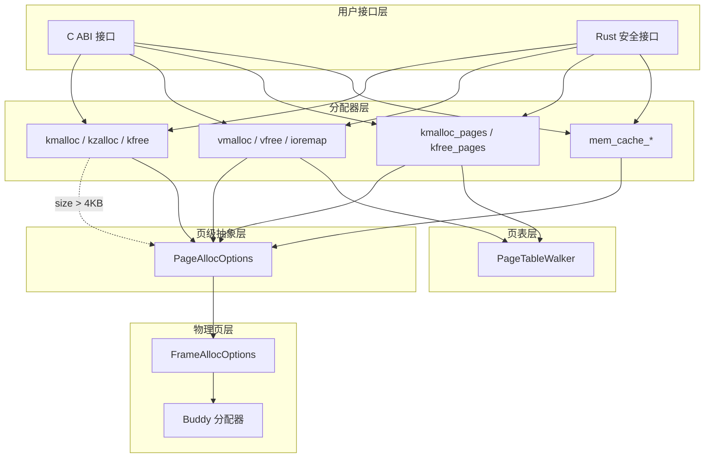
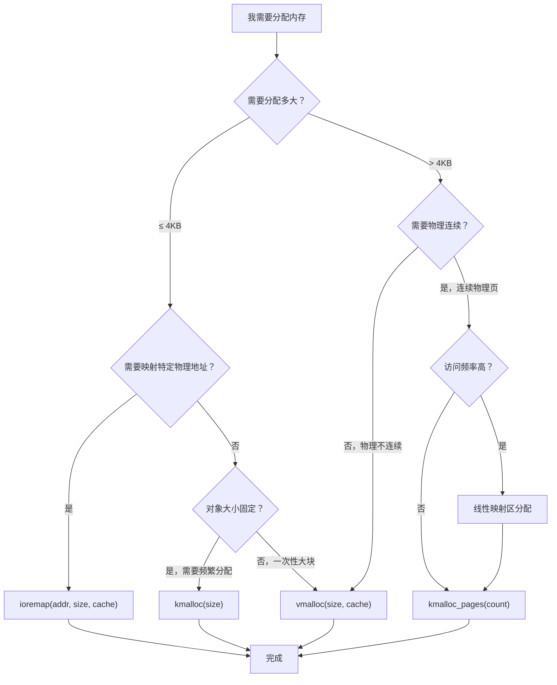
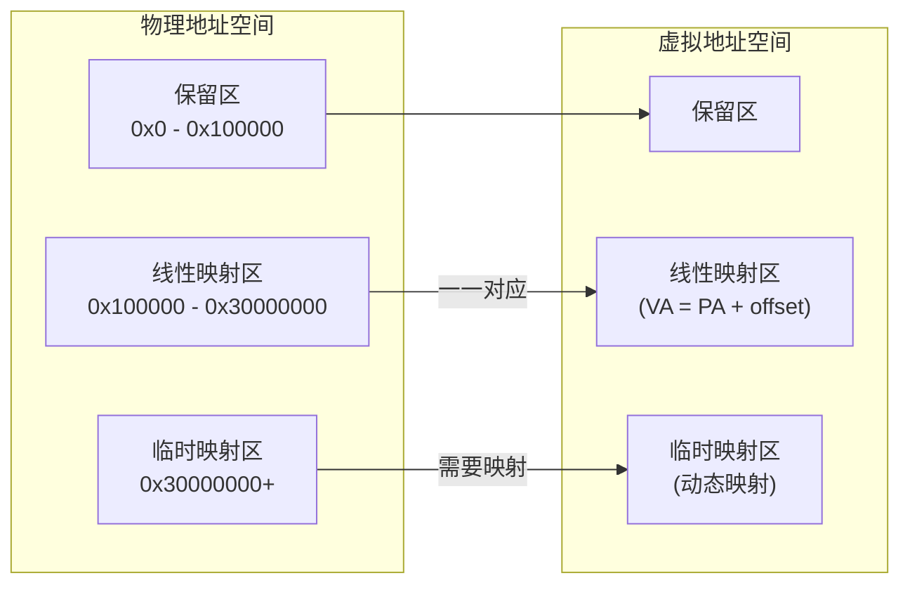
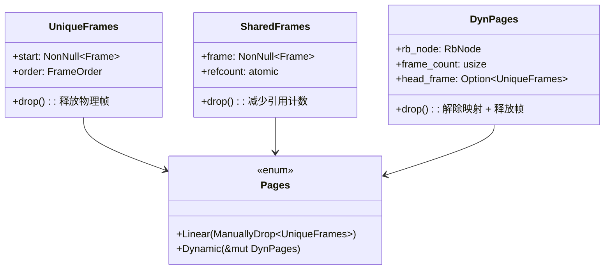
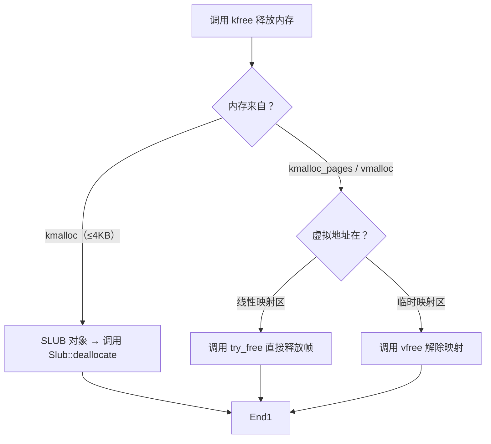

# 内存管理接口总览

本文档提供内核内存管理接口的用户指南，帮助开发者选择正确的接口并理解其行为。

---

## 1. 系统架构

Horizon 的内存管理系统采用分层架构，各层职责清晰：



---

## 2. 接口选择决策树

根据你的使用场景，选择合适的接口：



### 接口对照表

| 接口 | 适用场景 | 物理内存 | 虚拟地址 | 最大大小 |
|------|----------|----------|----------|----------|
| `kmalloc` | 小对象（≤4KB） | 连续 | 线性映射区 | 4KB |
| `kzalloc` | 同 kmalloc，但自动清零 | 连续 | 线性映射区 | 4KB |
| `vmalloc` | 大块内存，物理不连续 | 非连续 | 临时映射区 | 无上限 |
| `ioremap` | 映射设备/固定物理地址 | 固定 | 临时映射区 | 无上限 |
| `kmalloc_pages` | 需要大块连续内存 | 连续 | 线性映射区/临时映射区 | 4MB (order=10) |

---

## 3. 内存区域划分

32 位内核将物理内存划分为以下区域：

| 区域 | 地址范围 | 说明 |
|------|----------|------|
| 保留区 | 0x000000 - 0x100000 (1MB) | BIOS、GDT、IDT、内核栈 |
| 线性映射区 | 0x100000 - 0x30000000 (896MB) | 内核主要使用，虚拟地址 = 物理地址 + 偏移 |
| 临时映射区 | 0x30000000 - 0xFFFFFFFF (3GB) | vmalloc/ioremap/用户态内存，需要动态映射 |



---

## 4. 所有权模型

内存分配涉及三种主要的所有权类型：



### 所有权说明

| 类型 | 说明 | 释放行为 |
|------|------|----------|
| `UniqueFrames` | 独占引用一组物理页 | Drop 时归还给 Buddy 分配器 |
| `SharedFrames` | 共享引用，通过引用计数管理 | 引用计数为 0 时释放 |
| `Pages::Linear` | 线性映射区的物理页 | 需手动调用 `kfree_pages` |
| `Pages::Dynamic` | 通过 vmalloc/ioremap 映射的页 | Drop 时自动解除映射并释放 |

### 重要：释放规则



**安全释放要点**：
- `kfree` 只能释放内核线性映射区内的内存
- 传入错误指针会导致未定义行为（双倍释放或访问已释放内存）
- `vfree` 必须在对应的虚拟地址上调用

---

## 5. 错误处理

所有内存分配接口在失败时会返回 `Option` 或 `Result`：

```rust
// Rust 接口
pub fn kmalloc<T>(size: NonZeroUsize) -> Option<NonNull<T>>;
pub fn vmalloc<T>(size: NonZeroUsize, cache: PageCacheType) -> Result<NonNull<T>, MemoryError>;

// C 接口
void *kmalloc(size_t size);        // 失败返回 NULL
int vmalloc(size_t size);          // 失败返回 -1
```

建议错误处理方式：

| 场景 | 推荐处理 |
|------|----------|
| 中断上下文 | 使用原子分配（`GFP_ATOMIC`），失败时快速返回 |
| 内核初始化 | 使用 `expect()` 或 `unwrap()` 直接 panic |
| 可恢复错误 | 检查返回值，打印警告并使用备用路径 |

完整错误类型见 [07-errors.md](./07-errors.md)

---

## 6. 相关文档

- [02-kmalloc.md](./02-kmalloc.md) - 小内存分配
- [03-pages.md](./03-pages.md) - 页级分配
- [04-vmalloc.md](./04-vmalloc.md) - 虚拟内存分配
- [05-memcache.md](./05-memcache.md) - 对象缓存
- [06-address.md](./06-address.md) - 地址类型转换
- [07-errors.md](./07-errors.md) - 错误处理
- [08-c-api.md](./08-c-api.md) - C 接口速查