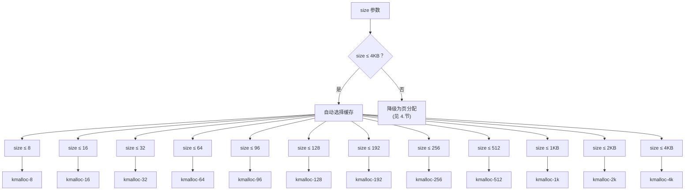
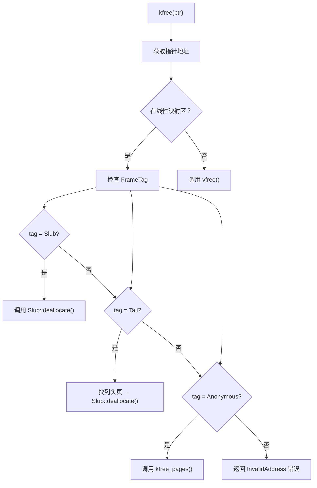

# 小内存分配接口

`kmalloc` 系列接口用于分配小于等于 4KB 的小对象，是内核中最常用的内存分配方式。

---

## 1. 接口函数

### 1.1 Rust 接口

```rust
// 分配 size 字节的内存，返回指向 T 类型的指针
pub fn kmalloc<T>(size: NonZeroUsize) -> Option<NonNull<T>>;

// 分配 size 字节的内存，并自动清零
pub fn kzalloc<T>(size: NonZeroUsize) -> Option<NonNull<T>>;

// 释放指针指向的内存
pub fn kfree<T>(ptr: NonNull<T>) -> Result<(), MemoryError>;
```

### 1.2 C 接口

```c
// 分配 size 字节的内存，失败返回 NULL
void *kmalloc(size_t size);

// 分配 size 字节的内存并清零，失败返回 NULL
void *kzalloc(size_t size);

// 释放指针指向的内存
void kfree(void *ptr);
```

---

## 2. 对象缓存选择策略

系统内置了多个对象缓存（SLUB），根据请求大小自动选择最合适的缓存：



### 缓存大小对照表

| 请求大小 | 实际分配的缓存 | 对象大小 | 内部对齐 |
|----------|----------------|----------|----------|
| 1 - 8 | kmalloc-8 | 8 字节 | 8 |
| 9 - 16 | kmalloc-16 | 16 字节 | 8 |
| 17 - 32 | kmalloc-32 | 32 字节 | 8 |
| 33 - 64 | kmalloc-64 | 64 字节 | 8 |
| 65 - 96 | kmalloc-96 | 96 字节 | 16 |
| 97 - 128 | kmalloc-128 | 128 字节 | 16 |
| 129 - 192 | kmalloc-192 | 192 字节 | 16 |
| 193 - 256 | kmalloc-256 | 256 字节 | 16 |
| 257 - 512 | kmalloc-512 | 512 字节 | 32 |
| 513 - 1024 | kmalloc-1k | 1024 字节 | 32 |
| 1025 - 2048 | kmalloc-2k | 2048 字节 | 32 |
| 2049 - 4096 | kmalloc-4k | 4096 字节 | 32 |

**注意**：实际分配的大小会进行对齐，实际可用空间可能大于请求大小。

---

## 3. kfree 的智能释放

`kfree` 能自动识别内存类型并调用对应的释放函数：



**释放流程细节**：

| FrameTag | 内存来源 | 释放操作 |
|----------|----------|----------|
| `Slub` | kmalloc 小对象 | 调用 `Slub::deallocate()` 归还到缓存池 |
| `Tail` | 4KB 以上大对象的尾部页 | 找到头页，调用 `Slub::deallocate()` |
| `Anonymous` | kmalloc 大于 4KB 或直接页分配 | 调用 `kfree_pages()` 释放物理页 |

---

## 4. 大于 4KB 的 Fallback

当请求大小超过 4KB 时，`kmalloc` 会自动降级为页级分配：

```rust
// kmalloc.rs 中的 fallback 逻辑
pub fn kmalloc<T>(size: NonZeroUsize) -> Option<NonNull<T>> {
    match select_cache(size) {
        Some(cache) => cache.allocate(),      // ≤ 4KB：使用 SLUB
        _ => {
            // > 4KB：降级为页分配
            let ilog = size.get().next_power_of_two().ilog2() as usize;
            let order = FrameOrder::from_count(ilog - ArchPageTable::PAGE_BITS);
            let page_options = PageAllocOptions::kernel(order);
            let mut pages = page_options.allocate().ok()?;
            Some(unsafe { NonNull::new_unchecked(pages.get_ptr()) })
        }
    }
}
```

**Fallback 行为说明**：

1. 计算所需页数（进位到 2 的幂）
2. 调用 `PageAllocOptions::kernel(order)` 分配物理页
3. 返回的指针位于线性映射区
4. 释放时通过 `kfree` 自动识别为 `Anonymous` 类型，调用 `kfree_pages()`

---

## 5. 使用示例

### 5.1 基本分配与释放

```rust
use core::ptr::NonNull;

// 分配 64 字节的内存
let ptr: Option<NonNull<u8>> = kmalloc(NonZeroUsize::new(64).unwrap());

// 使用内存
if let Some(ptr) = ptr {
    unsafe {
        ptr.as_ptr().write_bytes(0xAA, 64);
    }
    // 释放内存
    kfree(ptr.cast()).unwrap();
}
```

### 5.2 C 代码

```c
// 分配内存
void *buf = kmalloc(128);
if (buf == NULL) {
    // 处理错误
    return -1;
}

// 使用内存
memset(buf, 0, 128);

// 释放内存
kfree(buf);
```

---

## 6. 注意事项

### 6.1 只能分配内核线性映射区内存

`kmalloc` 分配的内存位于内核线性映射区（虚拟地址 0x100000 - 0x30000000）。尝试释放非内核内存会导致 `InvalidAddress` 错误：

```rust
// 错误示例：尝试释放 vmalloc 分配的内存
let ptr = vmalloc(size, PageCacheType::WriteBack).unwrap();
kfree(ptr);  // 会出错！应该用 vfree()
```

### 6.2 必须使用正确的指针

`kfree` 要求必须传入由 `kmalloc` 分配的原始指针：
- 传入偏移后的指针会导致双倍释放
- 传入随机指针会导致未定义行为

### 6.3 对齐与实际大小

由于 SLUB 缓存的对齐要求，实际分配的大小可能大于请求值：

```c
// 请求 30 字节
void *p = kmalloc(30);

// 实际可能分配了 32 字节（下一个对齐级别）
// 但释放时仍然只需要传入 p
kfree(p);
```

### 6.4 不适合原子上下文

`kmalloc` 内部可能在内存不足时触发重试（最多 3 次），这在原子上下文中可能导致问题。原子上下文应使用页面级分配或预先分配。

---

## 7. 相关文档

- [01-overview.md](./01-overview.md) - 内存管理总览
- [03-pages.md](./03-pages.md) - 页级分配（kmalloc_pages）
- [07-errors.md](./07-errors.md) - 错误处理