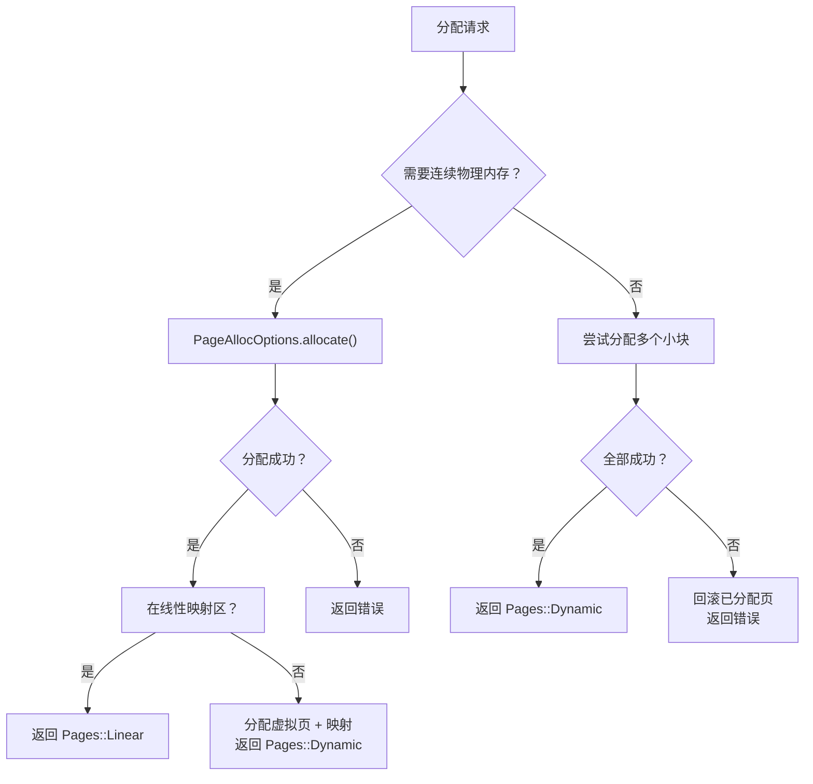
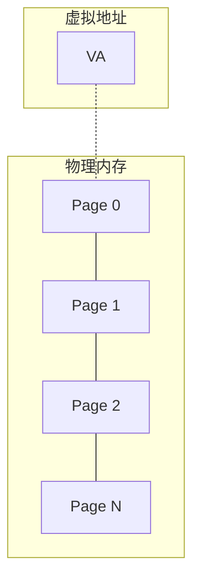
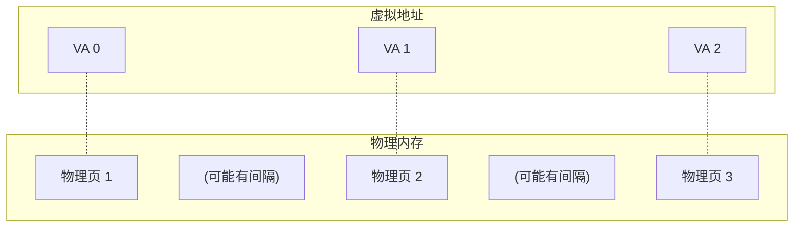
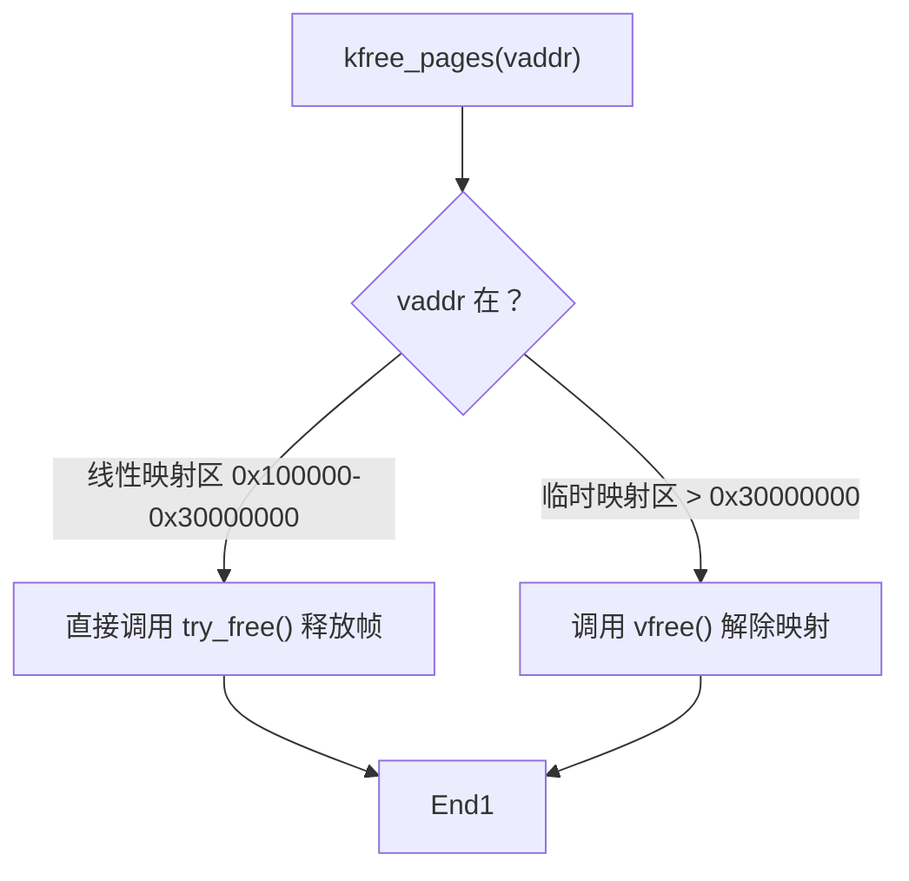

# 页级内存分配接口

页级分配接口用于分配整页或更大块的物理内存，适用于需要大块连续内存的场景。

---

## 1. 接口函数

### 1.1 Rust 接口

```rust
// 分配 count 个物理页
pub fn kmalloc_pages<'a>(count: NonZeroUsize) -> Result<Pages<'a>, MemoryError>;

// 释放虚拟地址对应的物理页
pub fn kfree_pages(vaddr: VirtAddr) -> Result<(), MemoryError>;
```

### 1.2 C 接口

```c
// 分配 count 页，返回虚拟地址（失败返回 NULL）
void *kmalloc_pages(size_t count);

// 释放虚拟地址对应的物理页（成功返回 0，失败返回 -1）
int kfree_pages(void *vaddr);
```

---

## 2. 与 kmalloc 的区别

| 特性 | kmalloc | kmalloc_pages |
|------|---------|---------------|
| 适用大小 | ≤ 4KB | 任意（4KB~4MB） |
| 内存类型 | 对象（SLUB 缓存） | 整页物理内存 |
| 返回值 | 原始指针 | Pages 枚举 |
| 释放方式 | kfree | kfree_pages |
| 物理连续性 | 一定连续 | 按要求连续 |

---

## 3. 连续 vs 非连续分配



### 3.1 连续物理内存分配 (contiguous=true)



- 适用于 DMA 操作、设备缓冲区等需要物理连续的内存
-Order 自动向上取整到 2 的幂（如请求 3 页会分配 4 页）

### 3.2 非连续物理内存分配 (contiguous=false)



- 虚拟地址连续，物理地址可以不连续
- 适用于临时缓冲区、大块数据存储等场景

---

## 4. PageAllocOptions 预设

系统提供了几种预设配置：

```rust
// 适用于内核常规分配
PageAllocOptions::kernel(order)

// 适用于原子上下文分配（不允许重试）
PageAllocOptions::atomic(order)

// IO 内存分配（固定物理地址）
PageAllocOptions::mmio(start, count, cache_type)
```

### Preset 对比

| 预设 | 适用场景 | 重试策略 | Zone fallback |
|------|----------|----------|---------------|
| `kernel` | 大多数内核路径 | 3 次重试 | LinearMem → MEM32 |
| `atomic` | 中断处理、持锁上下文 | 失败即返回 | LinearMem → MEM32 |
| `mmio` | 映射设备内存 | 失败即返回 | 固定地址 |

---

## 5. 使用示例

### 5.1 分配连续物理内存

```rust
use crate::kernel::memory::page::PageAllocOptions;
use crate::kernel::memory::frame::FrameAllocOptions;
use crate::kernel::memory::frame::FrameOrder;

// 分配 1 页（4KB）连续内存
let order = FrameOrder::new(0);
let options = PageAllocOptions::kernel(order);
let pages = options.allocate().unwrap();

// 获取虚拟地址
let vaddr = pages.start_addr();

// 释放
kfree_pages(vaddr).unwrap();
```

### 5.2 分配大块内存

```rust
// 分配 1MB 内存（256 页）
let order = FrameOrder::new(8);  // 2^8 = 256 页
let options = PageAllocOptions::kernel(order);

// 如果 order ≥ 10 (4MB)，会尝试使用大页映射优化
```

### 5.3 C 代码

```c
#include <stddef.h>

// 分配 16 页
void *buf = kmalloc_pages(16);
if (buf == NULL) {
    return -1;
}

// 使用内存
memset(buf, 0, 16 * 4096);

// 释放
kfree_pages(buf);
```

---

## 6. Order 与页数对应

| Order | 页数 | 大小 | 备注 |
|-------|------|------|------|
| 0 | 1 | 4KB | 最小单元 |
| 1 | 2 | 8KB | |
| 2 | 4 | 16KB | |
| 3 | 8 | 32KB | |
| 4 | 16 | 64KB | |
| 5 | 32 | 128KB | |
| 6 | 64 | 256KB | |
| 7 | 128 | 512KB | |
| 8 | 256 | 1MB | |
| 9 | 512 | 2MB | |
| 10 | 1024 | 4MB | 最大（支持大页） |

---

## 7. 释放注意事项

### 7.1 线性映射区 vs 临时映射区



### 7.2 只能释放内核管理的内存

以下情况会导致错误：
- 尝试释放预留内存（Reserved）
- 尝试释放用户态内存
- 传入空指针或未分配的地址

---

## 8. 相关文档

- [01-overview.md](./01-overview.md) - 内存管理总览
- [02-kmalloc.md](./02-kmalloc.md) - 小内存分配
- [04-vmalloc.md](./04-vmalloc.md) - 虚拟内存分配
- [06-address.md](./06-address.md) - 地址类型转换