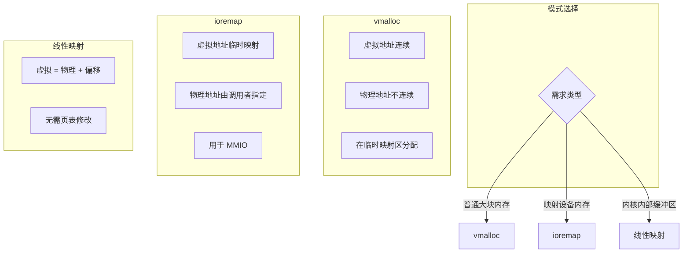
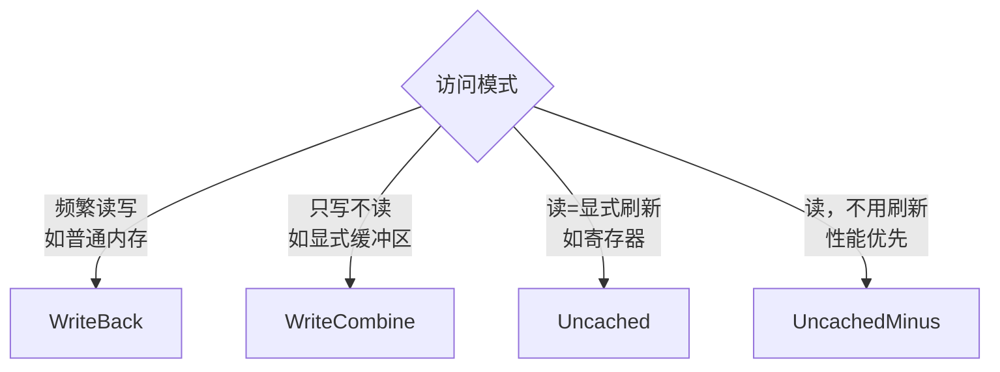
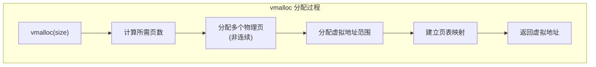
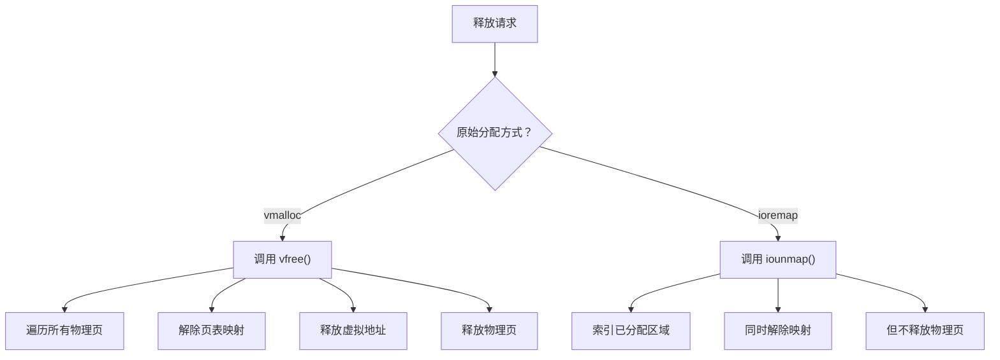

# 虚拟内存分配接口

虚拟内存分配接口用于分配需要动态映射的内存区域，包括 `vmalloc`（物理不连续）和 `ioremap`（映射固定物理地址）。

---

## 1. 接口函数

### 1.1 Rust 接口

```rust
// 分配虚拟连续、物理不连续的内存
pub fn vmalloc<T>(
    size: NonZeroUsize,
    cache_type: PageCacheType
) -> Result<NonNull<T>, MemoryError>;

// 释放 vmalloc 分配的内存
pub fn vfree(vaddr: VirtAddr) -> Result<(), MemoryError>;

// 映射物理地址固定的内存（如设备 IO）
// 返回 Pages 枚举而非原始指针，便于管理生命周期
pub fn ioremap<'a>(
    addr: PhysAddr,
    size: usize,
    cache_type: PageCacheType
) -> Result<Pages<'a>, MemoryError>;

// 解除 ioremap 映射
pub fn iounmap(vaddr: VirtAddr) -> Result<(), MemoryError>;
```

### 1.2 C 接口

```c
// 分配虚拟连续、物理不连续的内存
void *vmalloc(size_t size, int cache_type);

// 释放 vmalloc 分配的内存
void vfree(void *vaddr);

// 映射物理地址固定的内存
void *ioremap(unsigned long phys_addr, unsigned long size, int cache_type);

// 解除 ioremap 映射
void iounmap(void *vaddr);
```

---

## 2. 三种分配模式对比



### 模式对比表

| 特性 | vmalloc | ioremap | 线性映射 |
|------|---------|---------|----------|
| 物理地址 | 自动分配 | 调用者指定 | 虚拟=物理+偏移 |
| 虚拟地址 | 临时映射区 | 临时映射区 | 线性映射区 |
| 物理连续 | 不需要 | 不需要 | 必需 |
| 适用场景 | 大块缓冲区 | 设备 MMIO | 小对象分配 |
| 性能开销 | 较高（需映射） | 较高（需映射） | 最低（直接访问） |

---

## 3. 缓存类型选择

根据访问模式选择合适的缓存类型：



### 缓存类型说明

| 类型 | 行为 | 适用场景 |
|------|------|----------|
| `WriteBack` | 写回缓存，延迟写入内存 | 普通内存读写 |
| `WriteThrough` | 直写，写入时同时写内存 | 需要一致性 |
| `WriteCombine` | 合并写操作后批量写入 | 显式缓冲区 |
| `Uncached` | 不缓存，可能重排 | 寄存器映射 |
| `UncachedMinus` | 完全不缓存，直接写 | DMA 缓冲区 |

---

## 4. vmalloc 详解

### 4.1 工作原理



### 4.2 使用示例

```rust
use crate::kernel::memory::vmalloc;
use crate::kernel::memory::PageCacheType;

// 分配 64KB 内存
let size = NonZeroUsize::new(65536).unwrap();
let ptr = vmalloc::<u8>(size, PageCacheType::WriteBack).unwrap();

// 使用后释放
vfree(VirtAddr::new(ptr.as_ptr() as usize)).unwrap();
```

```c
// C 代码
void *buf = vmalloc(65536, 0);  // cache_type = WriteBack
if (buf == NULL) {
    return -1;
}

// 使用后释放
vfree(buf);
```

---

## 5. ioremap 详解

### 5.1 适用场景

- 映射 PCI 设备 BAR 地址
- 映射 ACPI 表内存
- 任何需要访问固定物理地址的场景

### 5.2 使用示例

```rust
use crate::kernel::memory::ioremap;
use crate::kernel::memory::PageCacheType;
use crate::arch::PhysAddr;

// 映射 0xFED00000 处的设备寄存器（4KB）
let phys_addr = PhysAddr::new(0xFED00000);
let ptr = ioremap(phys_addr, 4096, PageCacheType::Uncached).unwrap();

// 访问设备寄存器
let reg = unsafe { ptr.as_ptr() as *const u32 };
let value = reg.read_volatile();

// 使用后释放
iounmap(VirtAddr::new(ptr.as_ptr() as usize)).unwrap();
```

---

## 6. 释放注意事项

### 6.1 vfree vs iounmap



**重要区别**：
- `vfree` 会释放物理页
- `iounmap` 只解除映射，物理页属于硬件设备，不会被释放

### 6.2 硬件仍在访问的风险

解除 iounmap 映射之前，必须确保：
1. 硬件不再访问该地址
2. 已完成所有待处理的 DMA 操作
3. 驱动已正确关闭

否则可能导致数据丢失或系统崩溃。

---

## 7. 常见错误

| 错误 | 原因 | 解决方案 |
|------|------|----------|
| `OutOfMemory` | 临时映射区不足 | 减少同时分配的 vmalloc 总量 |
| `InvalidAddress` | 尝试释放线性映射区内存 | 使用 kfree_pages |
| `EntryAlreadyMapped` | 同一虚拟地址重复 ioremap | 先 iounmap 再重新映射 |

---

## 8. 相关文档

- [01-overview.md](./01-overview.md) - 内存管理总览
- [02-kmalloc.md](./02-kmalloc.md) - 小内存分配
- [03-pages.md](./03-pages.md) - 页级分配
- [06-address.md](./06-address.md) - 地址类型转换
- [07-errors.md](./07-errors.md) - 错误处理