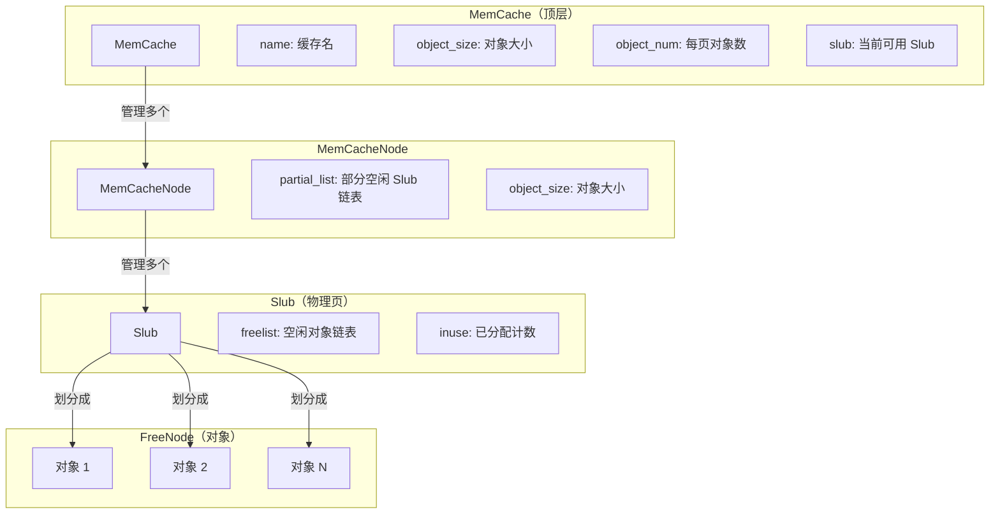
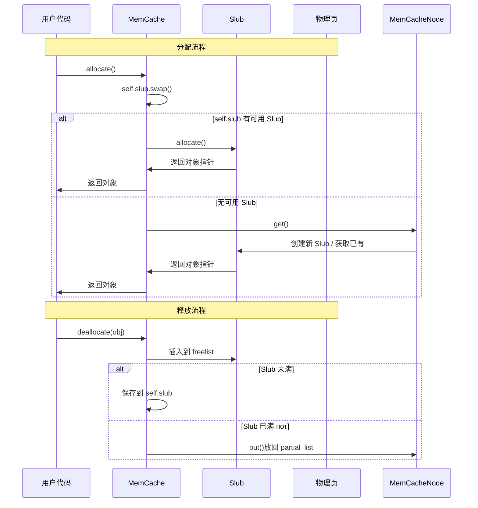
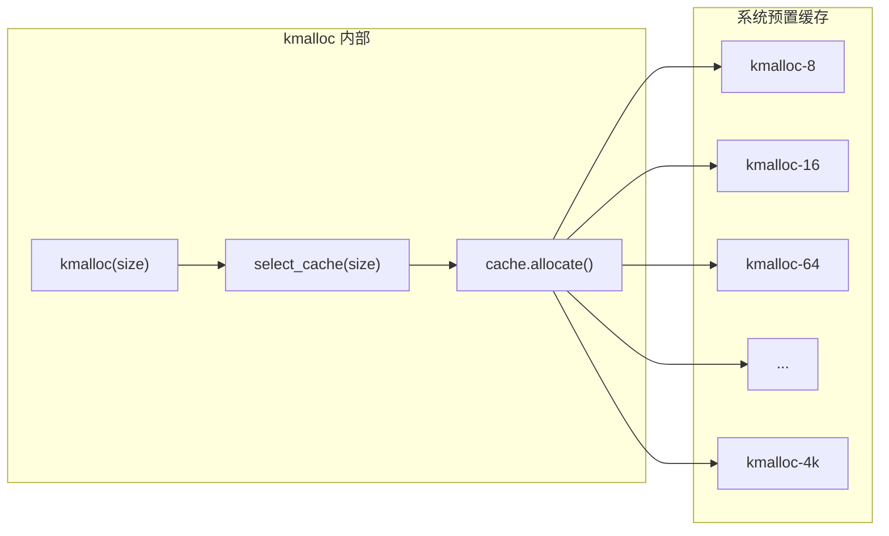

# 对象缓存接口

对象缓存（MemCache/SLUB）是用于高效分配固定大小对象的内存分配器。系统已内置通用缓存供 `kmalloc` 使用，同时也支持手动创建自定义缓存。

---

## 1. 接口函数

### 1.1 Rust 接口

```rust
// 创建对象缓存
pub fn mem_cache_create(
    name: &CStr,
    object_size: u16,
    align: usize
) -> Option<NonNull<MemCache>>;

// 从缓存分配对象
pub fn allocate<T>(&self) -> Option<NonNull<T>>;

// 销毁对象缓存
pub fn try_destroy(ptr: NonNull<Self>) -> Option<()>;
```

### 1.2 C 接口

```c
// 创建对象缓存，失败返回 NULL
struct mem_cache *mem_cache_create(
    const char *name,
    size_t object_size,
    size_t align
);

// 从缓存分配对象，失败返回 NULL
void *mem_cache_alloc(struct mem_cache *cache);

// 销毁对象缓存，成功返回 0
int mem_cache_destroy(struct mem_cache *cache);
```

---

## 2. 内部层级结构



### 层级说明

| 层级 | 职责 | 生命周期 |
|------|------|----------|
| `MemCache` | 管理对象缓存配置，分配 Slub | 与缓存同在 |
| `MemCacheNode` | 管理多个 Slub，提供空闲 Slub | 随缓存创建 |
| `Slub` | 将物理页划分为固定大小对象 | 按需创建/销毁 |
| `FreeNode` | 单个对象的空闲链表节点 | 分配/释放时复用 |

---

## 3. 创建自定义缓存

### 3.1 适用场景

- 频繁分配/释放同一类型结构体
- 需要特定对齐方式
- 想复用已释放对象而非归还给系统
- 减少内存碎片

### 3.2 创建示例

```c
// 创建一个用于分配 my_struct 的缓存
struct mem_cache *my_cache = mem_cache_create(
    "my_struct_cache",      // 缓存名称
    sizeof(struct my_struct),  // 对象大小
    16                      // 对齐要求
);

if (my_cache == NULL) {
    // 创建失败处理
    return -1;
}

// 分配对象
struct my_struct *obj = mem_cache_alloc(my_cache);
if (obj == NULL) {
    return -1;
}

// 使用对象
obj->field1 = value1;
obj->field2 = value2;

// 释放对象（归还到 Slub 缓存池，可被下次分配复用）
// 注意：使用 kfree 归还对象到缓存池，而非 mem_cache_free
kfree(obj);

// 销毁缓存（不再需要时）
mem_cache_destroy(my_cache);
```

---

## 4. 分配与释放流程



---

## 5. 与 kmalloc 的关系

`kmalloc` 实际上是使用预定义对象缓存的便捷接口：



| 接口 | 底层使用 | 说明 |
|------|----------|------|
| `kmalloc(size)` | 自动选择缓存 | 大小 ≤ 4KB |
| `kmalloc_pages(count)` | PageAllocOptions | 大小 > 4KB |
| `mem_cache_create` | 用户自定义缓存 | 任意大小，可指定对齐 |

---

## 6. 注意事项

### 6.1 对象大小限制

- 最小：`8` 字节
- 最大：`4096` 字节（一个页）

### 6.2 对齐要求

如果没有特殊对齐要求，传入 `align = 0` 或让系统自动计算。

### 6.3 释放必须用正确方式

释放 `mem_cache_alloc` 分配的对象有两个选择：

1. **归还给缓存**：使用 `kfree()` —— 对象会被放回缓存池，供下次分配复用
2. **销毁整个缓存**：使用 `mem_cache_destroy()` —— 释放所有 Slub 页面

```c
// 方式1：归还给缓存池（推荐）
struct my_struct *obj = mem_cache_alloc(my_cache);
kfree(obj);  // 对象归还给 Slub，下次 alloc 可复用

// 方式2：销毁缓存（不再需要时）
mem_cache_destroy(my_cache);  // 释放所有相关内存
```

### 6.4 缓存命名

建议使用有意义的名称，便于调试（如 `kmalloc-128`），系统内部可能使用这个名字来展示内存统计信息。

---

## 7. 相关文档

- [02-kmalloc.md](./02-kmalloc.md) - 小内存分配（使用内置缓存）
- [01-overview.md](./01-overview.md) - 内存管理总览
- [07-errors.md](./07-errors.md) - 错误处理