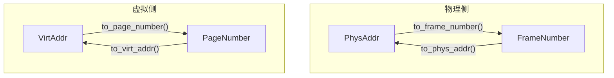
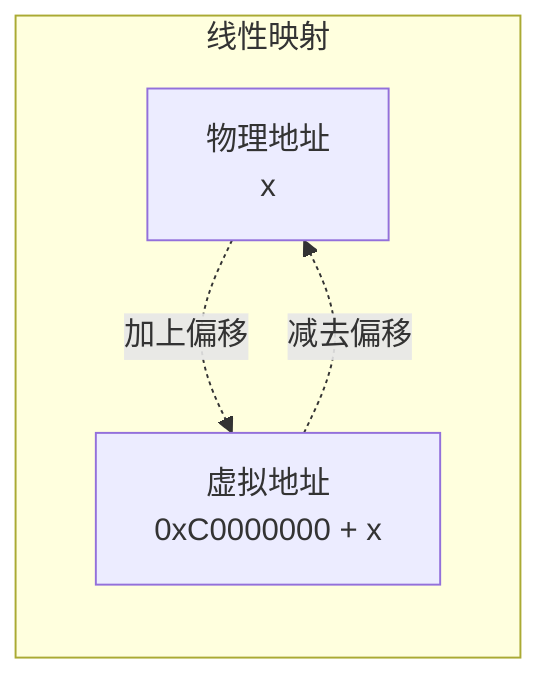
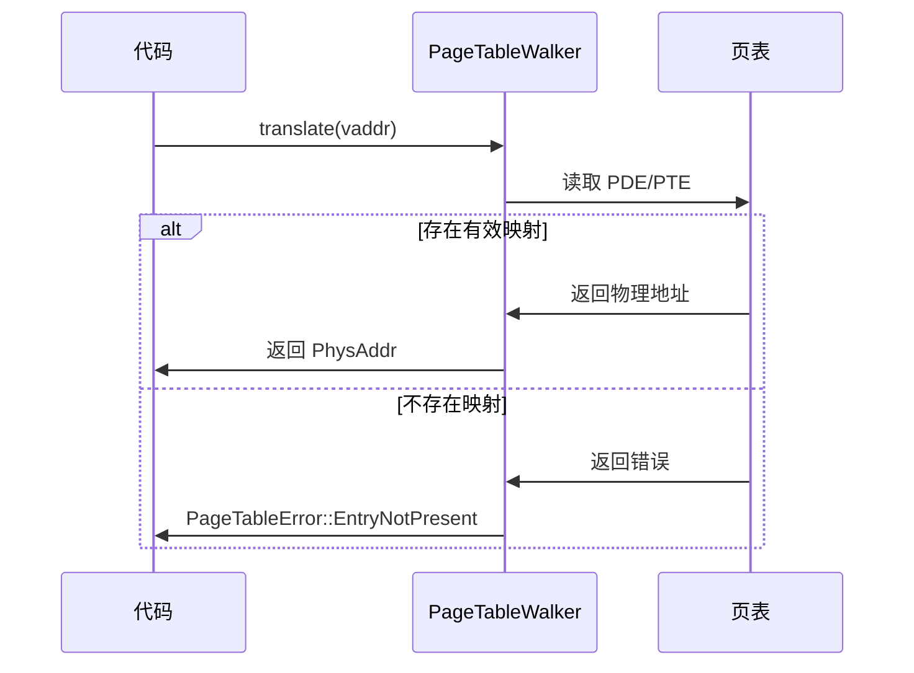
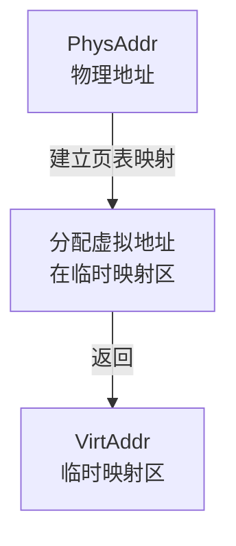
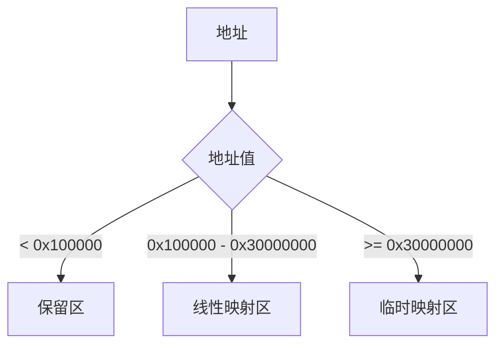

# 地址类型与转换

Horizon 内核使用强类型来区分不同类型的地址，减少操作错误。

---

## 1. 地址类型概述

| 类型 | 用途 | 底层表示 |
|------|------|----------|
| `PhysAddr` | 物理地址 | `usize` |
| `VirtAddr` | 虚拟地址 | `usize` |
| `FrameNumber` | 物理页号 | `usize` |
| `PageNumber` | 虚拟页号 | `NonZeroUsize` |

---

## 2. 类型定义

### 2.1 PhysAddr - 物理地址

```rust
pub struct PhysAddr(usize);

impl PhysAddr {
    // 创建物理地址
    pub const fn new(addr: usize) -> Self;

    // 获取原始 usize 值
    pub const fn as_usize(self) -> usize;

    // 转换为物理页号
    pub fn to_frame_number(self) -> FrameNumber;

    // 页对齐操作
    pub const fn page_align_down(self) -> Self;
    pub const fn page_align_up(self) -> Self;
    pub const fn page_offset(self) -> usize;
}
```

### 2.2 VirtAddr - 虚拟地址

```rust
pub struct VirtAddr(usize);

impl VirtAddr {
    // 创建虚拟地址
    pub const fn new(addr: usize) -> Self;

    // 获取原始 usize 值
    pub const fn as_usize(self) -> usize;

    // 转换为虚拟页号
    pub fn to_page_number(self) -> Option<PageNumber>;

    // 页对齐操作
    pub const fn page_align_down(self) -> Self;
    pub const fn page_align_up(self) -> Self;
    pub const fn page_offset(self) -> usize;
    pub const fn is_page_aligned(self) -> bool;
}
```

### 2.3 FrameNumber - 物理页号

```rust
pub struct FrameNumber(usize);

impl FrameNumber {
    pub const fn new(num: usize) -> Self;
    pub const fn get(self) -> usize;

    // 物理页号 → 物理地址
    pub fn to_phys_addr(self) -> PhysAddr;

    // 向下对齐到指定 order
    pub const fn align_down(self, order: FrameOrder) -> Self;
}
```

### 2.4 PageNumber - 虚拟页号

```rust
// 注意：使用 NonZeroUsize，0 表示无效
pub struct PageNumber(NonZeroUsize);

impl PageNumber {
    pub const fn new(num: NonZeroUsize) -> Self;
    pub const fn get(self) -> NonZeroUsize;

    // 虚拟页号 → 虚拟地址
    pub const fn to_addr(self) -> VirtAddr;
}
```

---

## 3. 地址转换关系



---

## 4. 常见转换场景

### 4.1 线性映射区转换

在线性映射区，虚拟地址和物理地址有固定偏移关系：



```rust
let vaddr = VirtAddr::new(0xC1000000);
let offset = vaddr.offset_from(vir_base_addr());  // 偏移量
let paddr = PhysAddr::new(offset);  // 物理地址
```

### 4.2 虚拟地址转换到物理地址（页表查询）



```rust
use crate::kernel::memory::mapping::PageTableWalker;
use crate::kernel::memory::arch::X86PageTable;

// 查询虚拟地址对应的物理地址
let vaddr = VirtAddr::new(some_address);
match X86PageTable::translate(vaddr) {
    Ok(paddr) => println!("物理地址: {}", paddr),
    Err(e) => println!("翻译失败: {:?}", e),
}
```

### 4.3 物理地址转虚拟地址（临时映射）



这种方法主要用于 ioremap 场景，详情见 [04-vmalloc.md](./04-vmalloc.md)。

---

## 5. 常用操作示例

### 5.1 地址对齐检查

```rust
let vaddr = VirtAddr::new(0xC1000123);

// 检查是否页对齐
if !vaddr.is_page_aligned() {
    println!("地址未对齐，偏移: {:#x}", vaddr.page_offset());
}

// 对齐到页边界
let aligned = vaddr.page_align_down();
let next_page = vaddr.page_align_up();
```

### 5.2 页号与地址互转

```rust
use crate::kernel::memory::frame::FrameNumber;
use crate::kernel::memory::arch::ArchPageTable;

// 物理页号 → 物理地址
let frame = FrameNumber::new(256);
let paddr = frame.to_phys_addr();

// 物理地址 → 物理页号
let paddr = PhysAddr::new(0x100000);
let frame = paddr.to_frame_number();

// FrameNumber 的基本操作
let frame_val = frame.get();
```

### 5.3 获取内核线性基地址

```rust
use crate::kernel::memory::vir_base_addr;

// 获取内核线性映射区的起始虚拟地址
let base = vir_base_addr();
println!("内核线性基地址: {:#x}", base);
```

---

## 6. Zone 判断

根据地址判断所属 Zone：



```rust
use crate::kernel::memory::frame::ZoneType;

let paddr = PhysAddr::new(0x20000000);
let zone = ZoneType::from_address(paddr);
match zone {
    ZoneType::LinearMem => println!("在线性映射区"),
    ZoneType::MEM32 => println!("在临时映射区"),
}
```

---

## 7. 相关文档

- [01-overview.md](./01-overview.md) - 内存管理总览
- [02-kmalloc.md](./02-kmalloc.md) - 小内存分配
- [04-vmalloc.md](./04-vmalloc.md) - 虚拟内存分配
- [07-errors.md](./07-errors.md) - 错误处理