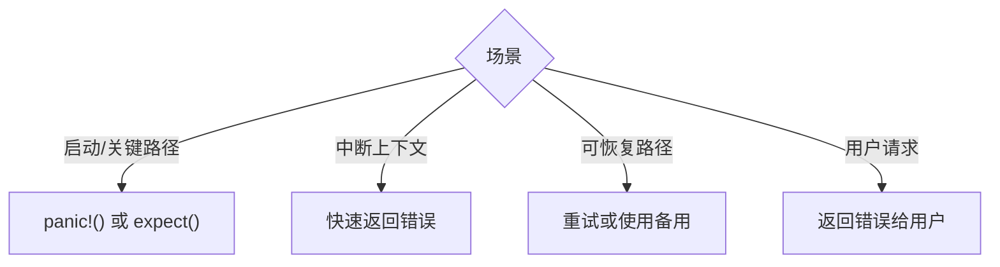

# 错误类型与处理

本文档介绍内存管理接口可能返回的错误类型以及建议的处理方式。

---

## 1. 错误类型定义

### 1.1 MemoryError 枚举

```rust
#[derive(Debug, Clone)]
pub enum MemoryError {
    /// 内存不足
    OutOfMemory,
    /// 地址冲突
    AddressConflict,
    /// 物理页不可用
    UnavailableFrame,
    /// 无效地址
    InvalidAddress(VirtAddr),
    /// 无效大小
    InvalidSize(usize),
    /// 物理页错误
    FrameError(FrameError),
    /// 页表错误
    PageTableError(PageTableError),
}
```

### 1.2 FrameError

```rust
#[derive(Debug, Clone, Copy)]
pub enum FrameError {
    /// 物理页类型不匹配
    IncorrectFrameType,
    /// 物理页冲突（已被分配）
    Conflict,
    /// 物理页耗尽
    OutOfFrames,
}
```

### 1.3 PageTableError

```rust
#[derive(Debug, Clone, Copy)]
pub enum PageTableError {
    /// 页表条目不存在
    EntryNotPresent,
    /// 页表条目已存在映射
    EntryAlreadyMapped,
    /// 无效的页表层级
    InvalidLevel,
}
```

---

## 2. 各接口可能返回的错误

### 2.1 kmalloc / kzalloc

| 返回值 | 原因 | 处理建议 |
|--------|------|----------|
| `None` | 内存不足或参数无效 | 打印错误，使用备用路径或返回错误 |

### 2.2 vmalloc / ioremap

| 错误 | 原因 | 处理建议 |
|------|------|----------|
| `OutOfMemory` | 临时映射区不足或物理内存不足 | 检查是否有内存泄漏 |
| `InvalidSize` | 大小为 0 | 验证输入参数 |
| `AddressConflict` | 尝试映射已映射的地址 | 先解除原映射 |

### 2.3 vfree / iounmap

| 错误 | 原因 | 处理建议 |
|------|------|----------|
| `InvalidAddress` | 地址不在有效范围内 | 验证地址有效性 |

### 2.4 物理页分配

| 错误 | 原因 | 处理建议 |
|------|------|----------|
| `FrameError::OutOfFrames` | Buddy 分配器物理页耗尽 | 减少同时分配的内存量 |
| `FrameError::Conflict` | 尝试分配已被分配的物理页 | 检查分配逻辑 |
| `FrameError::IncorrectFrameType` | 物理页类型不匹配 | 检查释放逻辑 |

---

## 3. 错误处理策略

### 3.1 按场景选择策略



### 3.2 各类场景的处理

| 场景 | 策略 | 示例 |
|------|------|------|
| 内核初始化 | `expect()` / `panic()` | 无法继续启动，直接 panic |
| 中断处理 | 快速失败 | 返回 `NULL` 让调用者处理 |
| 设备驱动 | 打印警告 + 备用路径 | 打印日志，使用预分配缓冲区 |
| 用户请求 | 返回错误 | 返回 Error 对象或 NULL |
| 可恢复错误 | 重试 3 次 | 使用 `kernel()` 预设（默认重试） |

### 3.3 示例代码

```rust
// 内核初始化：直接 panic
let pages = PageAllocOptions::kernel(order)
    .allocate()
    .expect("Failed to allocate initial pages");

// 中断上下文：快速失败
let ptr = kmalloc(size).ok_or_else(|| {
    printk!("WARN: kmalloc failed in atomic context\n");
    return Err(MemoryError::OutOfMemory);
});

// 常规路径：检查并处理
match vmalloc(size, cache) {
    Ok(ptr) => use(ptr),
    Err(MemoryError::OutOfMemory) => {
        printk!("WARN: vmalloc OOM, trying fallback\n");
        // 使用备用路径
    }
    Err(e) => {
        printk!("ERROR: vmalloc failed: {:?}\n", e);
        return Err(e);
    }
}
```

---

## 4. C 接口错误处理

C 接口无法返回复杂错误类型，使用返回值约定：

```c
// 分配类函数：失败返回 NULL
void *kmalloc(size_t size);        // NULL = 失败
void *vmalloc(size_t size);        // NULL = 失败  
void *ioremap(...);                // NULL = 失败
void *mem_cache_alloc(...);        // NULL = 失败

// 释放类函数：成功返回 0，失败返回 -1
int kfree(void *ptr);              // 0 = 成功, -1 = 失败
int kfree_pages(void *ptr);        // 0 = 成功, -1 = 失败
int vfree(void *ptr);              // 0 = 成功, -1 = 失败
int iounmap(void *ptr);            // 0 = 成功, -1 = 失败
int mem_cache_destroy(...);        // 0 = 成功, -1 = 失败
```

### 错误检查示例

```c
// 分配失败检查
void *buf = kmalloc(1024);
if (buf == NULL) {
    printk("ERROR: kmalloc failed\n");
    return -1;
}

// 释放失败检查
if (kfree(buf) != 0) {
    printk("ERROR: kfree failed, double-free or invalid pointer\n");
    return -1;
}
```

---

## 5. 常见错误与解决方案

### 5.1 double-free

```
ERROR: double-free detected for frame X, addr = ...
```

**原因**：同一指针被释放两次

**解决**：确保每个分配都有对应的释放，且只释放一次

### 5.2 内存泄漏

```
WARNING: Failed to free virtual memory at ... (memory leaked)
```

**原因**：释放路径出错，内存未能归还给分配器

**解决**：检查释放调用是否正确执行

### 5.3 使用已释放内存

```
WARNING: Accessing freed memory at ...
```

**原因**：释放后继续访问指针

**解决**：在释放后将指针设为 NULL，或使用 RAII 模式

### 5.4 映射冲突

```
PageTableError::EntryAlreadyMapped
```

**原因**：尝试映射已映射的虚拟地址

**解决**：先调用 `unmap` 或 `iounmap` 解除现有映射

---

## 6. 调试技巧

### 6.1 启用内存调试信息

系统内置了内存统计：

```rust
// 查看已分配页数
println!("Allocated pages: {}", ALLOCATED_PAGES.load(Ordering::Relaxed));

// 查看总页数
println!("Total pages: {}", TOTAL_PAGES.load(Ordering::Relaxed));
```

### 6.2 检查空闲链表

Buddy 分配器每阶都有空闲链表，可以检查是否有内存可用：

```rust
// 遍历各阶的空闲链表
for order in 0..=MAX_ORDER.get() {
    let count = zone.free_list[order].len();
    println!("Order {} has {} free blocks", order, count);
}
```

---

## 7. 相关文档

- [01-overview.md](./01-overview.md) - 内存管理总览
- [08-c-api.md](./08-c-api.md) - C 接口速查