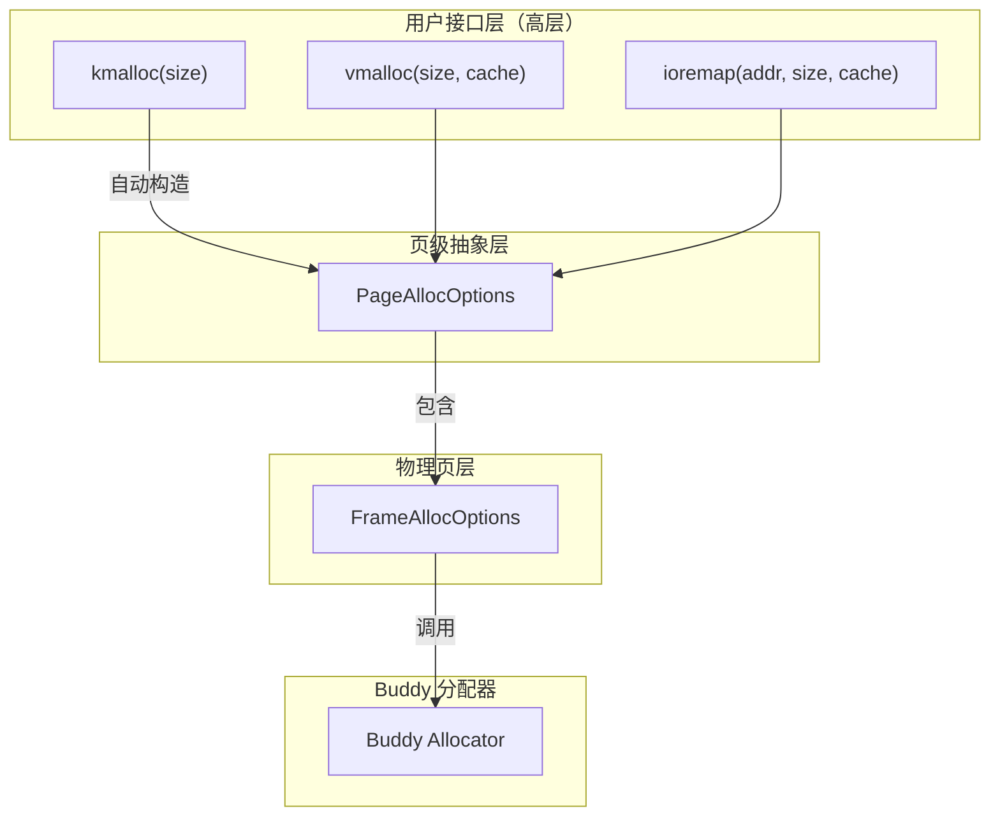
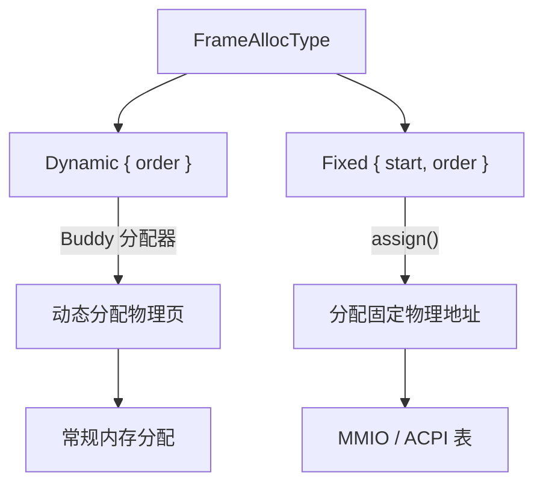
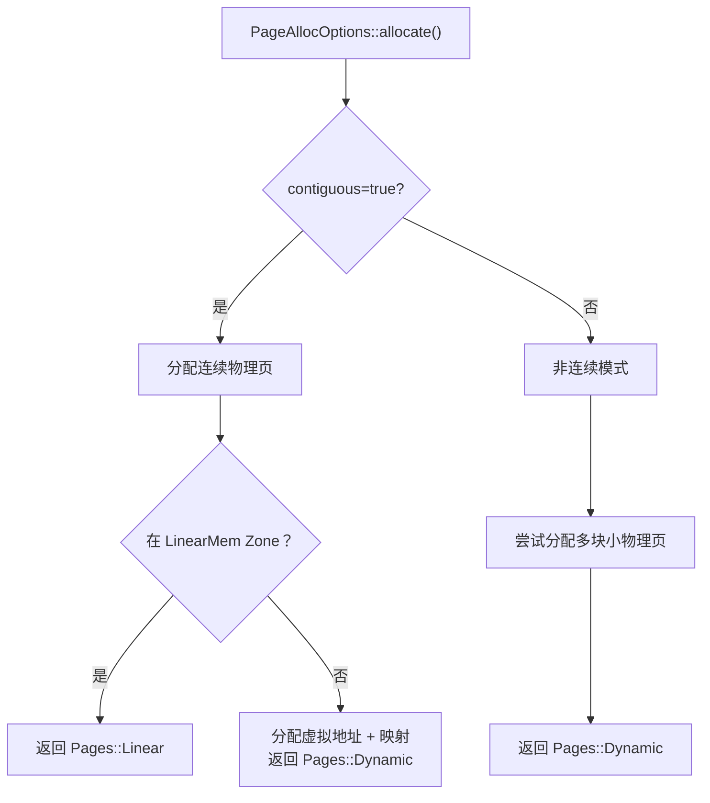

# 底层分配选项接口

`FrameAllocOptions` 和 `PageAllocOptions` 是内存管理系统的底层核心接口。上层的 `kmalloc`、`vmalloc`、`ioremap` 等接口都是基于它们构建的。

---

## 1. 两者关系



| 层级 | 职责 |
|------|------|
| `PageAllocOptions` | 负责虚拟地址分配、页表映射、缓存类型 |
| `FrameAllocOptions` | 负责物理页分配、Zone 选择、重试策略 |

---

## 2. FrameAllocOptions

### 2.1 定义

```rust
pub struct FrameAllocOptions {
    alloc_type: FrameAllocType,  // 分配类型
    fallback: FallbackChain,      // Zone 降级链
    retry: RetryPolicy,           // 重试策略
}
```

### 2.2 分配类型



两种类型：

| 类型 | 说明 | 适用场景 |
|------|------|----------|
| `Dynamic { order }` | 通过 Buddy 动态分配物理页 | 常规内存分配 |
| `Fixed { start, order }` | 分配固定物理地址 | 设备映射、ACPI 表 |

### 2.3 Zone 降级链

```rust
// 默认降级链
[Some(ZoneType::LinearMem), Some(ZoneType::MEM32)]
```

分配物理页时按顺序尝试各 Zone：


### 2.4 重试策略

```rust
pub enum RetryPolicy {
    FastFail,      // 立即失败
    Retry(usize),  // 重试 n 次
}
```

### 2.5 预设配置

```rust
// 类似 GFP_KERNEL：通用内核分配
FrameAllocOptions::kernel(order)
// 等价于:
// Self::new().dynamic(order).retry(RetryPolicy::Retry(3))
// 默认 fallback: LinearMem → MEM32

// 类似 GFP_ATOMIC：原子上下文分配
FrameAllocOptions::atomic(order)
// 等价于:
// Self::new().dynamic(order).retry(RetryPolicy::FastFail)
```

---

## 3. PageAllocOptions

### 3.1 定义

```rust
pub struct PageAllocOptions {
    frame: FrameAllocOptions,    // 物理页分配选项
    contiguous: bool,            // 是否需要物理连续
    cache_type: PageCacheType,   // 缓存类型
    zeroed: bool,                // 是否需要清零
    retry: RetryPolicy,          // 重试策略
    count: Option<NonZeroUsize>, // 指定页数
}
```

### 3.2 关键配置

| 字段 | 说明 | 可选值 |
|------|------|--------|
| `contiguous` | 是否需要物理连续 | `true` / `false` |
| `cache_type` | 缓存类型 | WriteBack, WriteCombine, Uncached, ... |
| `zeroed` | 是否需要清零 | `true` / `false` |
| `count` | 精确指定页数（覆盖 order） | `Some(count)` / `None` |

### 3.3 连续 vs 非连续分配



### 3.4 预设配置

```rust
// 内核常规分配
PageAllocOptions::kernel(order)
// 等价于:
// Self::new(FrameAllocOptions::atomic(order)).retry(RetryPolicy::Retry(3))

// 原子上下文分配
PageAllocOptions::atomic(order)
// 等价于:
// Self::new(FrameAllocOptions::atomic(order)).retry(RetryPolicy::FastFail)

// IO 内存映射（MMIO）
PageAllocOptions::mmio(start, count, cache)
```

---

## 4. 使用示例

### 4.1 自定义物理页分配

```rust
use crate::kernel::memory::frame::{
    FrameAllocOptions, FrameOrder, ZoneType, RetryPolicy
};

// 分配 8 页（512KB）
let order = FrameOrder::new(3);
let options = FrameAllocOptions::new()
    .dynamic(order)                           // 动态分配
    .fallback(&[ZoneType::LinearMem])         // 只从线性映射区分配
    .retry(RetryPolicy::Retry(3));            // 最多重试 3 次

let (frames, zone) = options.allocate().unwrap();
println!("分配了 {} 页，来自 {:?} 区", order.to_count().get(), zone);
```

### 4.2 自定义虚拟内存映射

```rust
use crate::kernel::memory::page::PageAllocOptions;
use crate::kernel::memory::PageCacheType;

// 分配 16KB，物理不连续，WriteCombine 缓存
let options = PageAllocOptions::new(
    FrameAllocOptions::kernel(FrameOrder::new(2))  // 4KB * 4 = 16KB
)
.contiguous(false)          // 允许物理不连续
.cache_type(PageCacheType::WriteCombine)
.zeroed(true);              // 需要清零

let pages = options.allocate().unwrap();
```

### 4.3 固定物理地址映射（ioremap 原理）

```rust
use crate::kernel::memory::frame::{FrameAllocOptions, FrameNumber, FrameOrder};
use crate::kernel::memory::page::PageAllocOptions;

// 映射设备寄存器
let device_addr = FrameNumber::new(0xFED00);  // 物理页号
let options = PageAllocOptions::mmio(
    device_addr,                        // 固定物理地址
    NonZeroUsize::new(1).unwrap(),     // 1 页
    PageCacheType::Uncached,           // 不缓存
);
```

---

## 5. 与上层接口的关系

| 上层接口 | 内部使用的 Options |
|----------|-------------------|
| `kmalloc(size ≤ 4KB)` | 通过 `MemCache` 间接使用 SLUB |
| `kmalloc(size > 4KB)` | `PageAllocOptions::kernel(order)` |
| `vmalloc` | `PageAllocOptions::new().contiguous(false).cache_type(...)` |
| `ioremap` | `PageAllocOptions::mmio(start, count, cache)` |
| `kmalloc_pages` | `PageAllocOptions::kernel(order)` |
| SLUB 缓存分配 | `PageAllocOptions::atomic(order)` |

---

## 6. 常见组合

### 6.1 需要物理连续的大块内存

```rust
PageAllocOptions::kernel(order)  // 默认 contiguous=true
```

### 6.2 需要高性能的临时缓冲区

```rust
PageAllocOptions::new(
    FrameAllocOptions::atomic(order)
)
.contiguous(false)               // 允许物理不连续
.cache_type(PageCacheType::WriteCombine);
```

### 6.3 映射 DMA 兼容内存

```rust
PageAllocOptions::new(
    FrameAllocOptions::new()
        .fallback(&[ZoneType::MEM32])  // DMA 在低 32 位地址
        .dynamic(order)
)
.contiguous(true)
.zeroed(true);
```

---

## 7. 相关文档

- [01-overview.md](./01-overview.md) - 内存管理总览
- [02-kmalloc.md](./02-kmalloc.md) - 小内存分配
- [03-pages.md](./03-pages.md) - 页级分配
- [04-vmalloc.md](./04-vmalloc.md) - 虚拟内存分配
- [doc/memory/page_allocation.md](./page_allocation.md) - 设计规范（详细设计说明）