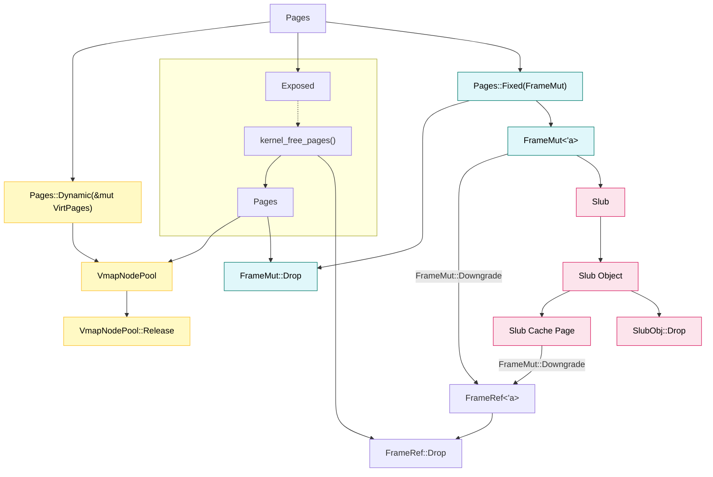

## Slub

### Alloc

**1.** (`kmalloc` -> ) `Slub::new` -> `Pages`

**2.**

```c++
Pages.frames[0] = FrameType::Slub;
```

### Free

```c++
if (((Slub *)Pages.frames[0])->in_use == 0) {
    kernel_page_free(Pages);
}
```

## Pages

**1. **`vmalloc` / `PageAllocOptions`

`Pages`

**2.** `vmalloc_c` / `ioremap`

`MannuallyDrop` + `FrameMut::from_raw`


---




### **🔹 图示说明**

1. **Fixed（线性页 / 恒等映射）**
   - 持有 FrameMut 独占物理页
   - Drop 时直接释放物理页
   - 可以 downgrade 成 FrameRef 共享访问
2. **Dynamic（vmalloc / 非连续页）**
   - 持有 &mut VirtPages
   - Drop 时只释放引用
   - VirtPages 放回 VmapNodePool，由 pool 统一管理后续释放或回收
3. **Slub 对象**
   - 分配在 slab cache page 上
   - 使用 FrameRef 或 FrameMut 指向物理页
   - Drop SlubObj → slab cache 处理回收
   - slab cache 页释放 → 可能减少物理页 refcount 或真正释放页
4. **引用计数管理**
   - FrameRef / FrameMut 控制 Frame 生命周期
   - Slub 对象内部可直接持有 FrameRef 或 FrameMut'
   - vmalloc 通过 Dynamic 不增加物理页 refcount（生命周期交给 pool / vfree）