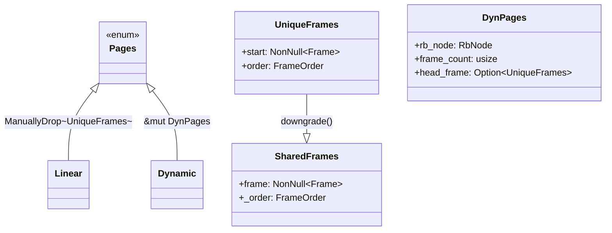
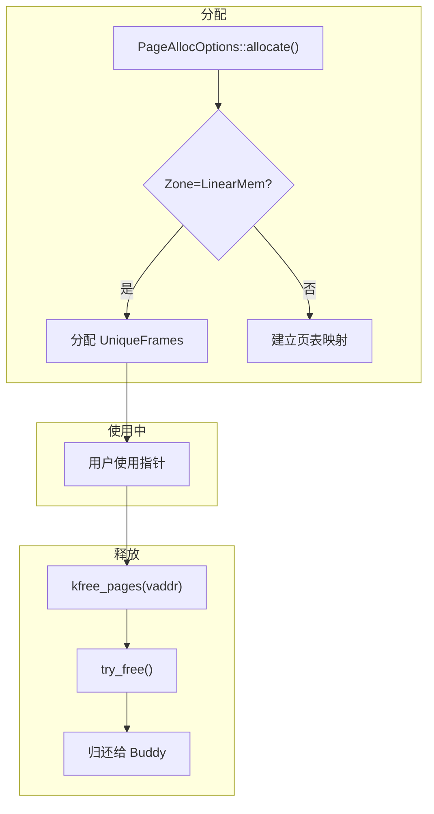
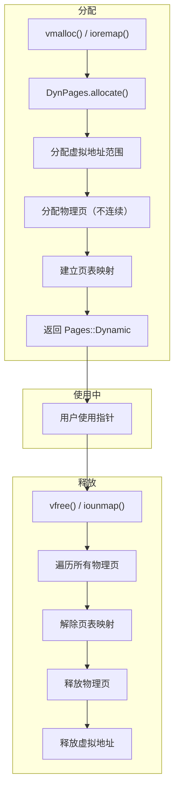
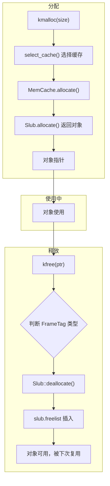
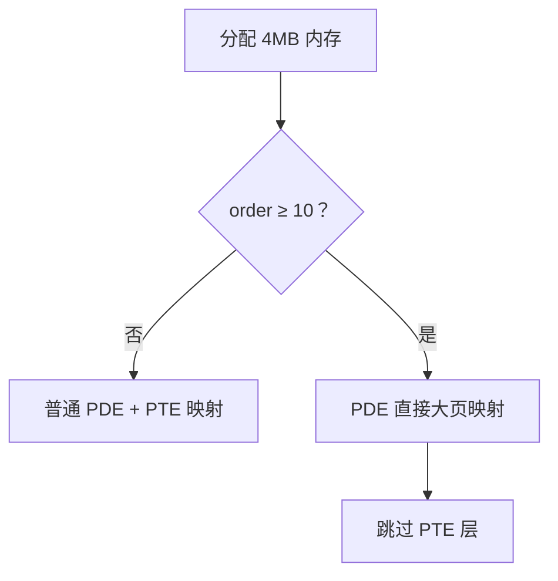
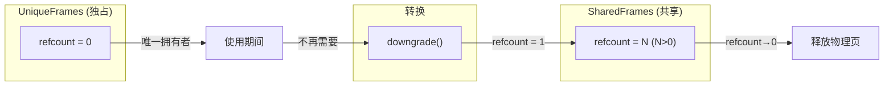

# Pages 生命周期与所有权

本文档展示内存分配过程中各种类型的所有权变化和生命周期管理。帮助你理解从分配到释放的完整流程。

> **注意**：本文档展示的是内部实现细节，常规使用请参考 [01-overview.md](./01-overview.md)。

---

## 1.内存类型对应关系

新旧 API 名称对照：

| 新名称 | 旧名称 | 说明 |
|--------|--------|------|
| `UniqueFrames` | `FrameMut` | 独占物理页引用 |
| `SharedFrames` | `FrameRef` | 共享物理页引用 |
| `DynPages` | `VirtPages` | 动态映射的虚拟页 |
| `Pages::Linear` | - | 线性映射区的物理页 |
| `Pages::Dynamic` | - | 动态映射的虚拟页 |

---

## 2. Pages 枚举类型

`Pages` 是一个枚举，根据内存来源和映射方式有不同的变体：

### 变体说明

| 变体 | 类型 | 内存区域 | 释放方式 |
|------|------|----------|----------|
| `Pages::Linear` | `ManuallyDrop<UniqueFrames>` | 线性映射区 | kfree_pages |
| `Pages::Dynamic` | `&mut DynPages` | 临时映射区 | Drop 时自动释放 |

---

## 3. 线性映射页（Linear）生命周期

### 线性页特点

- **虚拟地址 = 物理地址 + 偏移**（可直接访问）
- **独占所有权**：通过 `UniqueFrames` 管理
- **释放时**：直接调用 `try_free()` 归还给 Buddy 分配器

---

## 4. 动态映射页（Dynamic/vmalloc）生命周期

### 动态映射页特点

- **虚拟地址连续，物理地址可以不连续**
- 通过 `DynPages` 结构管理虚拟地址范围和物理页映射
- **释放时**：
  - 遍历所有已映射的物理页
  - 解除页表映射
  - 释放物理页
  - 将虚拟地址范围归还给 `VmapNodePool`

---

## 5. SLUB 对象生命周期

### SLUB 对象特点

- 分配自 SLUB 缓存页
- FrameTag 为 `Slub`
- 释放时归还到 `Slub.freelist` 链表，供下次分配复用
- **不是立即释放物理页**，而是被缓存池回收

---

## 6. 大页（Huge Page）支持

当分配的物理页 order ≥ 10（1024 页 = 4MB）时，系统会尝试使用大页映射优化：

### 大页特点

- **减少页表层级**：从 2 级减少到 1 级
- **提高 TLB 命中率**：减少 TLB 未命中
- **适合大块连续内存**：DMA 缓冲区、大文件缓存等

---

## 7. 引用计数管理

### 引用计数规则

| 状态 | refcount | 说明 |
|------|----------|------|
| 独占 | 0 | 唯一拥有者，无竞争 |
| 共享 | ≥1 | 多个引用，释放时递减 |

---

## 8. 总结

| 内存类型 | 管理者 | 释放方式 | 是否立即释放物理页 |
|----------|--------|----------|-------------------|
| kmalloc 小对象 | Slub.freelist | kfree → Slub::deallocate | 否（复用） |
| kmalloc 大页 | UniqueFrames | kfree_pages → try_free | 是 |
| vmalloc | DynPages | vfree | 是 |
| ioremap | DynPages | iounmap | 是（不释放物理） |
| 线性映射 | UniqueFrames | kfree_pages | 是 |

---

## 9. 相关文档

- [01-overview.md](./01-overview.md) - 内存管理总览
- [02-kmalloc.md](./02-kmalloc.md) - 小内存分配
- [04-vmalloc.md](./04-vmalloc.md) - 虚拟内存分配
- [doc/memory/page_allocation.md](./page_allocation.md) - 分配器设计规范