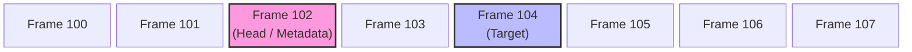
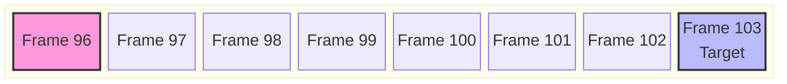
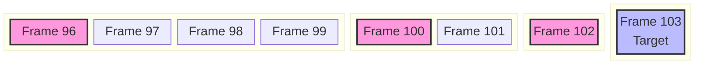

接下来讲讲物理页分配的核心算法——buddy

# 算法原理

Buddy 算法通过 **分割（split）和合并（merge）** 内存块来管理内存，为了便于管理，所有块的大小都是 2 的幂次方。

## 问题1

这个算法的诞生主要是为了解决内存的碎片化问题，假如内存一开始如下：


经过一系列分配和释放后就会变成这样：


这时候如果想要分配一个12KB的空间，明明有足够的连续空间，但是由于没有大于等于这个大小的块，无法被分配，除非重新整理碎片进行合并

## 解决方法1

在 Buddy 中，释放内存的时候就会自动尝试合并块，同时为了方便管理、避免出现奇奇怪怪大小的块，只合并相同大小的块，所以在 Buddy 中所有块的大小（即包含的页个数）都是 2 的幂。

## 问题2

此时还存在另一个问题，考虑以下情况：


这里用绿色表示已释放的页，当释放第 2 个页的时候，它就有可能尝试和右边的页合并：


此时，如果最右边的页也释放了


你就会发现，明明总共有 16 KB 的空间，可以合并成一个更大的块，但是因为合并的顺序问题，导致无法合并成更大的块，导致更多的碎片产生。

## 解决方法2

所以 Buddy 引入了另外一个要求，每个物理页必须要对齐到自己 order。此时，只要某个 order 范围内的页全被释放了，那么它就一定能被合并到 order 对应大小的块。

当然，在描述的问题中，“第二个页和第一个页合并不就没有问题了吗”，但是实际上，有可能 order 的边界刚好在第一和第二个页中间，选左或是选右边页合并的策略就是会出现这种问题的，所以应该看是否在同一 order 而不是选择左或者右。

# 数据结构

Buddy 分配器的结构很简单，就是一系列 order 的链表头，用自旋锁来解决竞争

```rust
pub struct BuddyAllocator {
    pub zones: [Zone; ZONE_COUNT],
}

pub struct Zone {
    pub free_frames: Spinlock<[ListHead<Buddy>; MAX_ORDER.0 as usize + 1]>,
}

#[repr(C, align(4))]
pub struct Buddy {
    list: SyncUnsafeCell<ListNode<Buddy>>,
    pub order: FrameOrder,
    pub zone_type: ZoneType,
}
```

这里的 `Buddy` 是会被放入物理页元数据的内容，其中包括了一个链表节点、order 记录和所属的 Zone

# 初始化

在内核初始化完页表之后，就需要初始化内存管理了，Buddy 的初始化步骤就是读取 Frame 元数据找到所有可用的物理页加入到链表管理起来

```rust
impl BuddyAllocator {
    /// 初始化Buddy内存分配器
    /// 1. 初始化所有Zone的空闲链表
    /// 2. 遍历Frame，根据Zone类型和Buddy order分割内存
    pub fn init(&self) {
        // 初始化所有Zone的空闲链表
        self.init_zone_lists();

        // 扫描Frame，初始化Buddy分配器
        self.populate_zones_from_e820();
    }

    /// 初始化所有Zone的空闲链表结构
    fn init_zone_lists(&self) {
        for i in 0..ZONE_COUNT {
            unsafe {
                self.zones[i].free_frames.init_with(|v| {
                    for free in v.iter_mut() {
                        Pin::new_unchecked(free).init();
                    }
                })
            };
        }
    }

    /// 遍历E820内存块，根据Zone和order将Free页加入对应的空闲链表
    fn populate_zones_from_e820(&self) {
        let mut zone_state = ZoneState::new();
        let mut frame_number = FrameNumber::new(0);

        while frame_number.get() < FRAME_INFO_COUNT {
            let frame = Frame::get_raw(frame_number);
            match Frame::get_tag_relaxed(frame_number) {
                FrameTag::Free => {
                    // 获取E820块的范围
                    let frame = UniqueFrames::from_allocator(frame, FrameOrder(0), self).unwrap();

                    let block_range = unsafe { frame.get_data().range };
                    frame_number = block_range.end;

                    self.add_free_block(&mut zone_state, block_range.start, block_range.end);
                }
                FrameTag::HardwareReserved | FrameTag::SystemReserved => {
                    // 跳过保留区
                    let range = unsafe { frame.as_ref().get_data().range };

                    frame_number = range.end;
                }
                FrameTag::Uninited => {
                    // 不可用页，可能是跨越了两个不同区域，继续下一个
                    frame_number = frame_number + 1;
                }
                _ => panic!("Buddy init: invalid frame tag"),
            }
        }
    }
}
```

这里使用了 `Pin<T>` 类型，因为 `ListNode<Owner>` 是侵入式数据结构，所以要求加入链表的节点地址必须不会改变

`add_free_block` 用来将可用的块填好信息后分割加入到链表当中：

```rust
/// 将一个E820内存块按Zone和Order分割加入Buddy系统
fn add_free_block(&self, zone_state: &mut ZoneState, mut start: FrameNumber, end: FrameNumber) {
    while start < end {
        // 找到当前地址对应的Zone并获取其范围
        let (zone_type, zone_boundary) = zone_state.get_zone_for_frame(start);
        let zone = self.get_zone(zone_type);

        // 起始地址也要对齐到当前Order
        let max_order = if start.get() == 0 {
            MAX_ORDER
        } else {
            FrameOrder::new((start.get().trailing_zeros() as u8).min(MAX_ORDER.0))
        };

        // 计算在当前Zone内能分割的最大范围
        // 受限于：E820块末尾、Zone边界、最大Order大小
        let chunk_end = end
            .min(start + max_order.to_count().get())
            .min(zone_boundary);

        let order = FrameOrder::from_frame_count(chunk_end.count_from(start));

        // 初始化该Buddy块的Frame结构
        unsafe {
            let mut frame =
                UniqueFrames::from_allocator(Frame::get_raw(start), FrameOrder(0), self)
                    .unwrap();

            frame.replace(
                FrameTag::Buddy,
                FrameData {
                    buddy: ManuallyDrop::new(Buddy {
                        list: SyncUnsafeCell::new(ListNode::new()),
                        order,
                        zone_type,
                    }),
                },
            );

            let _ = self.add_to_free_list((*frame).deref_mut(), order, zone);
        }

        start = chunk_end;
    }
}
```

这是真正加入链表的函数：
```rust
/// 将 Frame 添加回空闲链表
fn add_to_free_list(
    &self,
    frame: &mut Frame,
    order: FrameOrder,
    zone: &Zone,
) -> Result<(), FrameError> {
    unsafe {
        let node = Buddy::get_list(frame.try_into()?);
        let free = &mut zone.free_frames.lock()[order.get()];
        let mut head = Pin::new_unchecked(free);
        head.add_head(node);
    }
    Ok(())
}
```


# 分配

## 流程

我们首先构思一下分配的流程：

1. 首先找到目标要分配的 order 对应的链表
2. 如果链表为空，则继续向上寻找更大 order 的链表
3. 找到一个可用的块，将其从链表中删除
4. 如果这个块的 order 大于目标 order，将其分割
5. 填写好对应 Frame 的元数据，返回

## 实现

这样应该就比较好理解代码了：

```rust
fn allocate(&self, zone_type: ZoneType, order: FrameOrder) -> Option<UniqueFrames> {
    let mut order = order;
    let target_order = order;
    let mut buddy = None;

    while buddy.is_none() && order <= MAX_ORDER {
        let mut guard = self.get_zone(zone_type).free_frames.lock();
        let list_head = &mut guard[order.get()];

        buddy = if list_head.is_empty() {
            None
        } else {
            list_head.iter(Buddy::list_offset()).next()
        };

        if let Some(mut buddy) = buddy {
            let buddy = unsafe { buddy.as_mut() };
            buddy.get_list().del(list_head);

            let frame = unsafe { NonNull::from(Frame::from_child(buddy)) };
            let mut frame = UniqueFrames::from_allocator(frame, order, self).unwrap();
            drop(guard);

            if order != target_order {
                self.split(zone_type, order, target_order, &mut frame);
            }

            let anonymous = ManuallyDrop::new(Anonymous::new(order));
            unsafe { frame.replace(FrameTag::Anonymous, FrameData { anonymous }) };

            frame.set_tail_frames();

            ALLOCATED_PAGES.fetch_add(order.to_count().get(), Ordering::Relaxed);
            return Some(ManuallyDrop::into_inner(frame));
        }
        order.0 += 1;
    }
    None
}
```

这里的 `guard` 是我利用 Rust 的自动 Drop 机制，参考标准库 Mutex 实现的自动释放自旋锁的机制，中间的 `drop(guard)` 是手动释放自旋锁，防止阻塞太久。

`ALLOCATED_PAGES` 是用来统计已分配内存的，与分配逻辑无关。

这里刚分配的页没有其他信息，默认是 `Anonymous` 类型的页，调用方可以在分配过来之后再改成其他类型。

# 释放

## 流程
释放的流程也不算复杂

1. 先将其元数据恢复成 Buddy 内部管理用的
2. 尝试合并
3. 加入回链表

## 实现

```rust
fn deallocate(&self, frame: &mut Frame) -> Result<(), FrameError> {
    let addr = frame.start_addr();

    let zone_type = ZoneType::from_address(addr);
    let zone = self.get_zone(zone_type);
    let zone_range = zone_type.range();
    let (zone_start, zone_end) = (
        zone_range.0.to_frame_number(),
        zone_range.1.to_frame_number(),
    );

    if !matches!(frame.get_tag(), FrameTag::Anonymous) {
        return Err(FrameError::IncorrectFrameType);
    }
    let order = unsafe { frame.get_data().anonymous.get_order() };
    let count = order.to_count().get();

    let buddy = ManuallyDrop::new(Buddy::new(order, zone_type));
    unsafe { frame.replace(FrameTag::Buddy, FrameData { buddy }) };
    let mut frame = UniqueFrames::from_allocator(NonNull::from(frame), order, self).unwrap();

    ALLOCATED_PAGES.fetch_sub(count, Ordering::Relaxed);

    let frame_number = frame.to_frame_number().get();
    let max_order = FrameOrder::new(frame_number.trailing_zeros() as u8);
    let max_order = max_order.min(MAX_ORDER);

    let range = (zone_start, zone_end);

    while order < max_order {
        match self.merge_once(frame, order, range) {
            Ok(success) => frame = success,
            Err(failed) => {
                frame = failed;
                break;
            }
        }
    }

    self.add_to_free_list(&mut frame, order, zone)
}
```

## 合并

合并只在释放的时候进行，首先在 `deallocate` 里是外层的循环，逐层向上尝试合并到当前地址对齐的最大 order 。`merge_once` 只尝试一次合并同一 order 的物理页

```rust
fn merge_once(
    &self,
    frame: ManuallyDrop<UniqueFrames>,
    current_order: FrameOrder,
    range: (FrameNumber, FrameNumber),
) -> Result<ManuallyDrop<UniqueFrames>, ManuallyDrop<UniqueFrames>> {
    let frame_number = frame.to_frame_number();

    let new_order = current_order + 1;
    let count = new_order.to_count().get();

    let low = frame_number.align_down(new_order);
    let high = low + count;

    if low < range.0 || high > range.1 {
        return Err(frame);
    }

    let is_low = low == frame_number;
    let buddy = Frame::get_raw(if is_low { high } else { low });

    let pair = match UniqueFrames::from_allocator(buddy, current_order, self) {
        Some(buddy) => {
            if is_low {
                Ok((frame, buddy))
            } else {
                Ok((buddy, frame))
            }
        }
        None => Err(frame),
    };

    pair.and_then(|(low, high)| {
        UniqueFrames::merge(low, high, self, Self::merge_exact)
            .map_err(|(low, high)| if is_low { low } else { high })
    })
}
```

`merge_once` 直接接受当前 `Frame` 的所有权，如果成功则返回合并后的 `Frame` 所有权，失败则原样返还所有权。

如同前面所介绍的，合并的时候不考虑左右，而是直接比较大一个 order 下的两个页是否能够合并。`UniqueFrames` 负责所有权的合并，传进去的 `merge_exact` 则是处理具体的 Frame 元数据

```rust
fn merge_exact(&self, left: &mut UniqueFrames, right: ManuallyDrop<UniqueFrames>) {
    let buddy: &mut Buddy = left.deref_mut().try_into().unwrap();

    let new_order = buddy.order.0 + 1;
    buddy.order = FrameOrder(new_order);

    let zone_type = buddy.zone_type;

    let mut frame = right;
    unsafe {
        frame.set_tag(FrameTag::Uninited);

        let node = Buddy::get_list(left.deref_mut().try_into().unwrap());
        let free = &mut self.get_zone(zone_type).free_frames.lock()[new_order as usize];
        let mut head = Pin::new_unchecked(free);

        head.add_head(node);
    }
}
```

# 静态分配

在我的设计中，物理内存是全部交给 Buddy 管理的，所以也有必要提供一个静态分配的接口，提供给物理地址固定的 MMIO, ACPI 表 之类的。

## 问题

一个很简单的问题：我随机给一个物理页的地址，你要怎么找到它的元数据来剔除指定区域？



## 解决方案

首先，逐个页往前找肯定不现实，Buddy 中最大的块有 1024 个页，遍历的性能开销不算小。

好在，Buddy 有一个独特的要求：物理页组的头一个页必须对齐到它的 order，反过来说这个页的帧号也限制了它所能对齐的最大 order。也就是说，我们往前找时肯定是找对齐了 order 的页。而且，如果前面这组页的范围要覆盖到指定的这个物理页的话，它的 order 肯定大于等于当前这个物理页所能对齐的最大 order。

举个例子：

在问题中的给定的帧号是 104，104 的因数中为 2 的幂的最大值就是 8，对应的 order 是 3。那么设想一下，这组页的头一个页肯定在给定页的前面，如果这组页的 order 小于等于 3 的话：

- 为 3，对齐后最接近的是 96

- 为 2，对齐后最接近的是 100

- 为 1，对齐后最接近的是 102
- 为 0，对齐后最接近的是 103

不管怎么算，小于等于当前 order 的页都是无法覆盖到当前页的。也就是说，我们只要从比当前页大 1 个的 order 开始找，一直找到最大的 order 10。最坏的情况下也只需要查找 10 次（因为哪怕 order 为 0 的情况也是要从 1 开始找的）

## 代码

所以寻找头的代码如下：

```rust
fn derive_head_frame(
    frame_number: FrameNumber,
    current_order: FrameOrder,
) -> Option<FrameNumber> {
    debug_assert!(frame_number.align_down(current_order) == frame_number);
    let frame_number = frame_number;

    let order = frame_number.get().trailing_zeros() as u8;
    let order = FrameOrder::new(order.min(MAX_ORDER.0));

    // 检查自己是否刚好是头
    if let FrameTag::Buddy = Frame::get_tag_relaxed(frame_number) {
        return Some(frame_number);
    }

    // 否则往前找
    for order in order.get()..=MAX_ORDER.get() {
        let order = FrameOrder::new(order as u8);
        let start = (frame_number - 1).align_down(order);
        if matches!(Frame::get_tag_relaxed(start), FrameTag::Buddy) {
            return Some(start);
        }
    }

    // 没找到说明这块内存没被管理
    None
}
```


## 策略

那么找到了这组页的头之后，怎么将指定范围的地址剔除呢？其实很简单：

- 首先这组页的 order 减 1，这样是绝对不会碰到要剔除的页的
- 然后按照减小后的 order 往后找，定位到没被覆盖到的第一个物理页
- 接下来就是循环和指定页的帧号比较，不断尝试减小 order，为没被覆盖到的内存创建新的一组页





另外，由于 Buddy 都是以 order 为管理单位的，剔除时返回的指定内存的所有权也是以 order 为单位的 `UniqueFrames` ，所以提供的接口应该是：大小以 order 为单位、对齐了提供的 order 的

```rust
/// 从 Buddy 块中剔除 range 覆盖的页
fn exclude_from_buddy(
    &self,
    head: FrameNumber,
    current: FrameNumber,
    current_order: FrameOrder,
) -> Result<Option<FrameOrder>, FrameError> {
    let mut frame = UniqueFrames::from_allocator(Frame::get_raw(head), FrameOrder(0), self)
        .ok_or(FrameError::Conflict)?;

    // 检查是否已经被分配
    if !matches!(
        frame.get_tag(),
        FrameTag::Buddy | FrameTag::HardwareReserved
    ) {
        return Err(FrameError::IncorrectFrameType);
    }

    let buddy: &mut Buddy = (*frame).deref_mut().try_into()?;
    let order = buddy.order;
    let zone_type = buddy.zone_type;

    // 2 种情况：
    // 1. 被覆盖:   head.end > current.end
    // 2. 未被覆盖: head.end <= current.start

    // 情况 1：覆盖
    if order > current_order {
        debug_assert!(head + order.to_count().get() > current);

        let zone = &self.get_zone(zone_type).free_frames;
        let end = head + order.to_count().get();

        // 从链表中移除
        buddy.get_list().del(&mut zone.lock()[order.get()]);

        // 先处理左半部分
        let mut start = head;
        let mut order_ = order - 1;
        while start < current {
            let frame = Frame::get_raw(start);
            let mut frame = UniqueFrames::from_allocator(frame, order_, self).unwrap();
            let buddy: &mut Buddy = (*frame).deref_mut().try_into()?;

            buddy.get_list().del(&mut zone.lock()[order_.get()]);

            start = start + order_.to_count().get();
            order_ = order - 1;
        }

        // 再处理右半部分
        let mut start = current + current_order.to_count().get();
        while start < end {
            let order = start.get().trailing_zeros() as u8;
            let order = FrameOrder::new(order);
            let frame = Frame::get_raw(start);
            let mut frame = UniqueFrames::from_allocator(frame, order, self).unwrap();

            let buddy: &mut Buddy = (*frame).deref_mut().try_into()?;
            buddy.get_list().del(&mut zone.lock()[order.get()]);

            start = start + order.to_count().get();
        }
    }

    // 情况2: 未覆盖，不用处理

    Ok(Some(order))
}
```

## 接口

最后再在这两个函数的基础上完成这个接口

```rust
fn assign(&self, start: FrameNumber, order: FrameOrder) -> Result<UniqueFrames, FrameError> {
    debug_assert!(
        start.get() % order.to_count().get() == 0,
        "Assigned frame range must be aligned to its size"
    );

    let frame = Frame::get_raw(start);
    let mut frame =
        UniqueFrames::from_allocator(frame, order, self).ok_or(FrameError::Conflict)?;

    if order < MAX_ORDER && start >= RESERVED_END {
        // 查找 Buddy 块头部
        let head = Self::derive_head_frame(start, order);

        if let Some(head) = head {
            // 处理这个 Buddy 块
            self.exclude_from_buddy(head, start, order)?;
        }
    }
    // 如果已经是最大 order 了或者找不到，则无需往前找
    if matches!(frame.get_tag(), FrameTag::Uninited | FrameTag::Buddy) {
        let anonymous = ManuallyDrop::new(Anonymous::new(order));
        unsafe { frame.replace(FrameTag::Anonymous, FrameData { anonymous }) };
    } else {
        return Err(FrameError::Conflict);
    }

    frame.set_tail_frames();

    Ok(ManuallyDrop::into_inner(frame))
}
```

