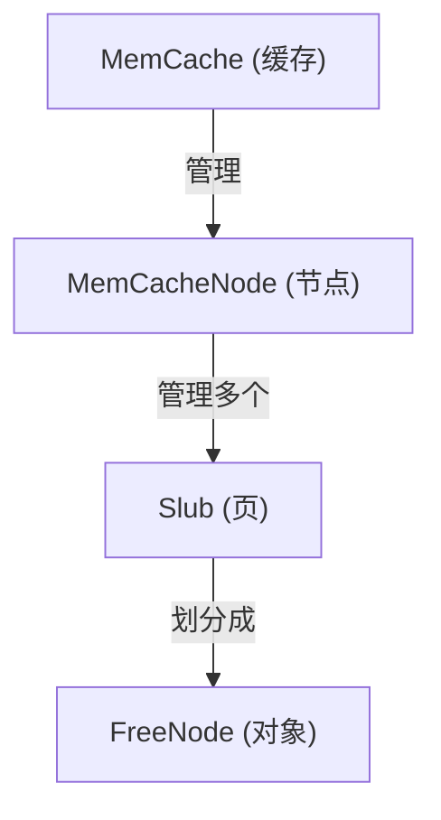

接下来讲的应该是内核中最常用的部分——小内存分配了。虽然内核中已经有了页管理，可以按页分配内存，但是一个页有 4KB，经常用的数据结构可能往往只有几十字节，粒度还是太大了。

# 结构

其实 SLUB 只是最下层的用来将页拆分成对象来管理的结构，只通过对象的大小来分类，而且一个 SLUB 只负责管理一组页。在上层会通过具体的对象类型来建立不同的 `MemCache`，并统一通过 `MemCache` 来管理




# SLUB

我这里参考了 Linux 中 SLAB 分配器的进化版 SLUB，SLUB 将一个页切成相同大小的多个对象，然后在分配的时候从其中取出一个空闲的对象即可。

## 结构

对于每个 Slub，我们只需要一个链表节点连接到对应的缓存，一个 `freelist` 存储空闲对象的链表头，以及一个 `inuse` 统计已分配对象个数即可。`freelist` 和 `inuse` 这种容易发生竞争、而且要保证同步更新的字段，通过自旋锁包裹来保证安全

```rust
#[repr(C)]
pub struct Slub {
    list: SyncUnsafeCell<ListNode<Self>>,
    inner: Spinlock<SlubInner>,
}

unsafe impl Sync for Slub {}

/// Slub 内部数据结构
#[repr(C, packed)]
pub struct SlubInner {
    /// 空闲对象头
    freelist: Option<NonNull<FreeNode>>,
    /// 正在使用的对象数量
    inuse: u16,
}
```

这里 `Slub` 和 `SlubInner` 都使用了 `#[repr(C)]` 确保布局可控，不然使用 `offset_of!` 宏时会出现奇怪的结果（没研究明白，但是用来实现 `container_of!` 时就是会出问题）

## 对象

首先，不同的对象需要为各自的大小创建不同的 Slub，在这里，先为系统默认的通用分配 `kmalloc` 设计一些比较常用的大小

```rust
/// 默认缓存列表（从 8 到 4096 bytes）
pub const DEFAULT_CACHE_CONFIGS: &[CacheConfig] = &[
    CacheConfig::new(c"kmalloc-8", NonZeroU16::new(8).unwrap())
        .ok()
        .unwrap(),
    CacheConfig::new(c"kmalloc-16", NonZeroU16::new(16).unwrap())
        .ok()
        .unwrap(),
    CacheConfig::new(c"kmalloc-32", NonZeroU16::new(32).unwrap())
        .ok()
        .unwrap(),
    CacheConfig::new(c"kmalloc-64", NonZeroU16::new(64).unwrap())
        .ok()
        .unwrap(),
    CacheConfig::new(c"kmalloc-96", NonZeroU16::new(96).unwrap())
        .ok()
        .unwrap(),
    CacheConfig::new(c"kmalloc-128", NonZeroU16::new(128).unwrap())
        .ok()
        .unwrap(),
    CacheConfig::new(c"kmalloc-192", NonZeroU16::new(192).unwrap())
        .ok()
        .unwrap(),
    CacheConfig::new(c"kmalloc-256", NonZeroU16::new(256).unwrap())
        .ok()
        .unwrap(),
    CacheConfig::new(c"kmalloc-512", NonZeroU16::new(512).unwrap())
        .ok()
        .unwrap(),
    CacheConfig::new(c"kmalloc-1k", NonZeroU16::new(1024).unwrap())
        .ok()
        .unwrap(),
    CacheConfig::new(c"kmalloc-2k", NonZeroU16::new(2048).unwrap())
        .ok()
        .unwrap(),
    CacheConfig::new(c"kmalloc-4k", NonZeroU16::new(4096).unwrap())
        .ok()
        .unwrap(),
];
```

我将支持的对象大小范围限制在了最小 8 字节，最大 4096 字节，也就是一个页

```rust
pub(super) const MIN_OBJECT_SIZE: usize = 8;
pub(super) const MAX_OBJECT_SIZE: usize = 4096;
```

然后还提供了选择默认 `MemCache` 的函数

```rust
pub const DEFAULT_CACHE_COUNT: usize = DEFAULT_CACHE_CONFIGS.len();

pub static DEFAULT_CACHES: SyncUnsafeCell<[AtomicPtr<MemCache>; DEFAULT_CACHE_COUNT]> =
    SyncUnsafeCell::new([const { AtomicPtr::new(null_mut()) }; DEFAULT_CACHE_COUNT]);

pub fn get_cache(index: usize) -> Option<NonNull<MemCache>> {
    if index >= DEFAULT_CACHE_COUNT {
        return None;
    }

    let cache_ptr = unsafe { (*DEFAULT_CACHES.get())[index].load(Ordering::Acquire) };
    NonNull::new(cache_ptr)
}

pub unsafe fn get_cache_unchecked(index: usize) -> NonNull<MemCache> {
    unsafe {
        let cache_ptr = (*DEFAULT_CACHES.get())[index].load(Ordering::Acquire);
        NonNull::new_unchecked(cache_ptr)
    }
}

pub fn select_cache<'a>(size: NonZeroUsize) -> Option<&'a mut MemCache> {
    let size = size.get().max(8);
    let ilog = size.next_power_of_two().ilog2() as usize;

    match ilog {
        0..=6 => unsafe { Some(get_cache_unchecked(ilog - 3).as_mut()) },
        7 => unsafe { Some(get_cache_unchecked(if size <= 96 { 4 } else { 5 }).as_mut()) },
        8 => unsafe { Some(get_cache_unchecked(if size <= 196 { 6 } else { 7 }).as_mut()) },
        8..=12 => unsafe { Some(get_cache_unchecked(ilog - 1).as_mut()) },
        _ => None,
    }
}
```

同时，为了减小大小无法对齐导致的大量浪费（如 96 和 192），SLUB 还有一套机制来计算出某个大小的对象需要几个页来减少浪费

## 如何选择对象大小

加入用户请求 24 字节，实际分配多少？

需要考虑：

1. **对齐**：对象地址需要对齐到 8/16/32 字节
2. **元数据**：debug 模式下需要 red zone、poison 等（暂且先不讨论）
3. **利用率**：尽量让页内空间不浪费

首先会根据传入的对象大小来计算它的对齐要求，通过它的最低置 1 位或者说尾部的 0 个数可以得到，当然还对其对齐进行了限制，范围是从 8 到缓存行大小（一般是 64）

`calculate_order` 是真正计算需要多少页的地方，通过尝试不同的 order 下的损失空间占比得到最优选择，从最严格的 1/16 到最宽松的 1/2，如果还是不行则返回错误

```rust
const fn calculate_order(size: ObjectSize) -> Result<FrameOrder, SlubError> {
    let mut size = size.0.get().next_multiple_of(size_of::<usize>() as u16);
    size = size.clamp(MIN_OBJECT_SIZE as u16, MAX_OBJECT_SIZE as u16);

    let mut order = MAX_FRAME_ORDER.get();
    let fractions = [16, 8, 4, 2];
    let mut i = 0;

    while i < fractions.len() {
        let fraction = fractions[i];
        i += 1;

        let mut _order = 0;
        while _order < MAX_FRAME_ORDER.get() {
            let slab_size = ArchPageTable::PAGE_SIZE << _order;

            let remain = slab_size % (size as usize);
            if remain < (slab_size / fraction) {
                order = _order;
                break;
            }
            _order += 1;
        }

        if order < MAX_FRAME_ORDER.get() {
            return Ok(FrameOrder::new(order as u8));
        }
    }

    if size <= MAX_OBJECT_SIZE as u16 {
        Err(SlubError::TooMuchWaste(
            (ArchPageTable::PAGE_SIZE << order) % (size as usize),
            size as usize,
        ))
    } else {
        Err(SlubError::TooLargeSize(size as usize))
    }
}

const fn calculate_sizes(
    size: NonZeroU16,
    align: usize,
) -> Result<(ObjectSize, NonZeroU16, FrameOrder, usize), SlubError> {
    let align = calculate_alignment(size.get() as usize, align);

    let size = size.get() as usize;

    let object_size = NonZeroU16::new(size.next_multiple_of(align) as u16)
        .expect("`object_size` should be non zero after alignment!");

    let object_size = ObjectSize(object_size);
    let order = calculate_order(object_size)?;

    let slab_size = ArchPageTable::PAGE_SIZE << order.get();

    let object_num = (slab_size / object_size.0.get() as usize) as u16;

    Ok((
        object_size,
        NonZeroU16::new(object_num).expect("`object_num` should be non zero after calculation!"),
        order,
        align,
    ))
}

const fn calculate_alignment(size: usize, align: usize) -> usize {
    let mut align = (align - 1).next_power_of_two();
    align = align.max(1 << size.trailing_zeros());
    align.clamp(MIN_ALIGN, CACHELINE_SIZE)
}
```

## 创建

然后就可以通过分配页来创建 Slub了

```rust
impl Slub {
    // 通用初始化逻辑
    fn init_slab(
        config: &CacheConfig,
        options: PageAllocOptions,
    ) -> Result<NonNull<Self>, MemoryError> {
        // 分配页
        let mut pages = options.allocate()?;

        let start_addr = pages.start_addr();
        let free_nodes = unsafe { start_addr.as_mut_ptr::<FreeNode>().as_mut().unwrap() };

        FreeNode::init(free_nodes, config);

        let freelist = NonNull::from(free_nodes);

        let first_frame = pages.get_frame().unwrap();

        let slub_info = Slub {
            list: SyncUnsafeCell::new(ListNode::new()),
            inner: Spinlock::new(SlubInner {
                freelist: Some(freelist),
                inuse: 0,
            }),
        };

        let slub = {
            set_slub(first_frame, slub_info);

            let slub: &mut Self = first_frame.deref_mut().try_into()?;
            NonNull::from_ref(slub)
        };

        Ok(slub)
    }

    pub fn new(
        config: &CacheConfig,
        options: PageAllocOptions,
    ) -> Result<NonNull<Self>, MemoryError> {
        Self::init_slab(config, options)
    }
}
```

`set_slub` 只是包装了一下将 Slub 写入到 `Frame` 元数据的操作，这样不需要额外分配内存

```rust
fn set_slub(frame: &mut Frame, slub_info: Slub) {
    unsafe {
        frame.replace(
            FrameTag::Slub,
            FrameData {
                slub: ManuallyDrop::new(slub_info),
            },
        )
    };
}
```

## FreeNode

所有空闲的对象只需要通过一个单向链表连起来即可管理，而且链表的每一个节点也不需要单独分配内存，直接使用对象的内存就好了

```rust
#[repr(C)]
pub struct FreeNode {
    pub next: Option<NonNull<FreeNode>>,
}
```

在每一个 Slub 的页刚分配过来时，需要先连接好这个链表

```rust
impl FreeNode {
    pub fn init(&mut self, config: &CacheConfig) {
        let mut current = NonNull::from(self);

        unsafe {
            for _ in 0..(config.object_num.get() - 1) {
                ent.byte_add(config.object_size.0.get() as usize);

                current.write(FreeNode { next: Some(next) });
                current = next;
            }

            current.write(FreeNode { next: None });
        }
    }
}
```

## 分配

从一个 SLUB 中分配一个对象非常简单，只需要从 `freelist` 中取出一个即可

```rust
/// 返回一个类型为`T`的对象的指针，内存大小在创建`Slub`时已确定
///
/// 如果该`Slub`没有剩余可用对象，则返回`None`
pub fn allocate<T>(&mut self) -> Option<NonNull<T>> {
    let freelist = self.freelist?;

    let node = freelist;
    self.freelist = unsafe { node.read() }.next;
    self.inuse += 1;

    Some(node.cast())
}
```

## 释放

释放也只需要插入到 `freelist`

```rust
pub fn deallocate<T>(&mut self, obj: NonNull<T>) {
    let node = obj.cast::<FreeNode>();

    unsafe {
        node.write(FreeNode {
            next: self.freelist,
        });
    }

    self.freelist = Some(node);

    self.inuse -= 1;
}
```

# 对象缓存初始化

对象缓存通过 `MemCache` 配合 `MemCacheNode` 来管理，`MemCache` 从 `MemCacheNode` 分配，`MemCacheNode` 来选择从具体的哪个 `Slub` 来分配

初始化时会碰到一个先有鸡还是先有蛋的问题，`MemCache` 和 `MemCacheNode` 作为小内存对象，需要小内存分配器，但是小内存分配器又需要从 `MemCache` 和 `MemCacheNode` 来分配，同时 `MemCache` 和 `MemCacheNode` 之间也有依赖关系需要解决。

## 存 MemCacheNode 的 MemCacheNode

首先先从只需要 `Slub` 的 `MemCacheNode` 开始解决，需要 `MemCacheNode` "bootstrap"

```rust
const OPTIONS: PageAllocOptions =
    PageAllocOptions::new(FrameAllocOptions::new()).contiguous(true);

// 从零创建 MemCacheNode，对应 "mem_cache_node" 的 MemCacheNode
let mem_cache_node = MemCacheNode::bootstrap(OPTIONS);
```

这里的 `bootstrap` 接受了一个页分配参数的输入，创建了一个用于分配 `MemCacheNode` 类型对象的 `MemCache` 所需要的 `MemCacheNode`，有点绕。

**bootstrap**

在 `MemCacheNode` 中，已经提前计算好了自己的对象大小等参数，直接用来创建 `Slub` 

```rust
impl MemCacheNode {
    const OBJECT_SIZE: NonZeroU16 = NonZeroU16::new(size_of::<Self>() as u16).unwrap();
    const CONFIG: CacheConfig = CacheConfig::new(c"MemCacheNode", Self::OBJECT_SIZE)
        .ok()
        .unwrap();
    
    pub fn init(&mut self, config: &CacheConfig, slub: Option<NonNull<Slub>>) {
        *self = Self {
            partial_list: Spinlock::new(PartialList {
                list_head: ListHead::empty(),
                count: 0,
            }),
            object_size: config.object_size,
        };

        unsafe {
            self.partial_list.init_with(|v| {
                let mut head = Pin::new_unchecked(&mut v.list_head);
                head.init();

                if let Some(mut slub) = slub {
                    let slub = slub.as_mut().get_list();
                    head.add_tail(slub);
                }
            })
        };
    }
    
    /// 创建一个Slub存放自身，作为 MemCacheNode 类型的 MemCache 的一个节点
    pub(super) fn bootstrap(mut options: PageAllocOptions) -> NonNull<Self> {
        let config = &Self::CONFIG;

        options = options.order(config.frame_order);

        let mut slub = Slub::new(config, options).unwrap();

        unsafe {
            let _slub = slub.as_mut();
            let mut mem_cache_node: NonNull<Self> = _slub.allocate(NonNull::dangling()).unwrap();

            mem_cache_node.as_mut().init(config, Some(slub));

            mem_cache_node
        }
    }
}
```

先凭空创造一个 `Slub` ，再从 `Slub` 中分配一块存放自己的内存，然后再在初始化自身的数据时将前面的 `Slub` 放到自己内部进行管理。这里在从 `Slub` 中分配时需要传入 `MemCache` 的指针使 `Slub` 能在分配完时保存好，但是这里是第一次分配不需要担心这个问题，所以直接传入悬垂指针

## 存 MemCache 的 MemCacheNode 和 MemCache

然后需要从已有的 `MemCacheNode` 中创建出第一个 `MemCache`

```rust
// 从 mem_cache_node 创建 "mem_cache" 的 MemCacheNode，再从零创建 "mem_cache" 的 MemCache
let mut mem_cache = MemCache::bootstrap(mem_cache_node, OPTIONS);
```

Bootstrap 流程有点烧脑

1. 首先创建一个用于分配 `MemCache` 类型的 `MemCacheNode` 
2. 然后创建一个新的 `Slub` ，用于初始化这个 `MemCacheNode`
3. 再从新的 `MemCacheNode` 中分配一块用于 `MemCache` 的内存
4. 最后在这块内存上完成第一个 `MemCache` （用于分配 `MemCache` 对象）的初始化

这里在刚从 `mem_cache_node` 分配完后重新设置了 `options` 的 order，因为原来的 `options` 是给 `mem_cache_node` 使用的，其他的 `MemCache` 可以使用相同的分配参数，但是修改 order 是必要的，因为不同大小的对象需要的页大小是不同的

```rust
fn bootstrap(
    mut mem_cache_node: NonNull<MemCacheNode>,
    mut options: PageAllocOptions,
) -> NonNull<Self> {
    unsafe {
        // 申请 "mem_cache" 的 MemCacheNode
        let mut node = mem_cache_node
            .as_mut()
            .new_self(&Self::CONFIG, options)
            .unwrap();
        options = options.order(Self::CONFIG.frame_order);

        let slub = Slub::new(&Self::CONFIG, options).unwrap();
        node.as_mut().init(&Self::CONFIG, Some(slub));

        // 申请 "mem_cache" 的 MemCache
        let mut mem_cache = {
            let node = node.as_mut();
            let mut slub = node.get(&Self::CONFIG, options).unwrap();
            let result = slub.as_mut().allocate::<MemCache>(NonNull::dangling());
            node.put(slub);
            result.unwrap()
        };

        mem_cache
            .as_mut()
            .init(Self::CONFIG, node, options)
            .expect("Unexpected error ocurred when bootstrapping MemCache!");

        mem_cache
    }
}
```

## 存 MemCacheNode 的 MemCache

左脚蹬右脚的最后一步是为单独的 `MemCacheNode` 创建一个 `MemCache` ，在此之后，所有的小内存都是通过 `MemCache` 来分配了

```rust
// 将 mem_cache_node 放入 "mem_cache"
let mem_cache_node = unsafe {
    MemCacheNode::bootstrap_cache(mem_cache_node, mem_cache.as_mut(), OPTIONS)
        .expect("Unexpected error occurred when bootstrapping MemCache")
};
```

内部通过 `new_from_node` 完成创建

```rust
/// 从已创建的 MemCacheNode 创建 "mem_cache_node" 的 MemCache
pub fn bootstrap_cache(
    mem_cache_node: NonNull<Self>,
    mem_cache: &mut MemCache,
    options: PageAllocOptions,
) -> Option<NonNull<MemCache>> {
    let mut mem_cache = mem_cache.allocate::<MemCache>()?;

    unsafe {
        mem_cache
            .as_mut()
            .init(
                Self::CONFIG,
                mem_cache_node,
                options.order(Self::CONFIG.frame_order),
            )
            .ok()?;
    }
    Some(mem_cache)
}
```

先分配一块 `MemCache` 类型的内存，然后再在这基础上完成初始化，其中修改了 `options` 的 order 满足需要。

## 默认缓存初始化

先为所有默认大小对象创建好缓存，然后在链表初始化时全部加入其中

```rust
unsafe {
    let caches_uninit = &mut *CACHES.get();
    let caches = caches_uninit.write(MemCaches {
        list_head: Spinlock::new(ListHead::empty()),
        mem_cache: mem_cache.as_ref(),
        node_mem_cache: mem_cache_node.as_ref(),
    });

    let mem_cache_node = caches.node_mem_cache;
    let mem_cache = caches.mem_cache;

    for (i, cache) in DEFAULT_CACHE_CONFIGS.iter().enumerate() {
        let cache_ptr = &mut *DEFAULT_CACHES.get();
        cache_ptr[i].store(
            MemCache::new_raw(*cache, mem_cache_node, mem_cache, OPTIONS)
                .expect("Unexpected error occurred when creating kmalloc- MemCache")
                .as_ptr(),
            Ordering::Release,
        );
    }

    caches.list_head.init_with(|v| {
        let mut head = Pin::new_unchecked(v);
        head.init();

        head.add_head(Pin::new_unchecked(&mut mem_cache_node.list));
        head.add_head(Pin::new_unchecked(&mut mem_cache.list));

        for cache in 0..DEFAULT_CACHE_COUNT {
            head.add_tail(Pin::new_unchecked(
                &mut get_cache(cache).unwrap().as_mut().list,
            ));
        }
    });
}
```

完成这些初始化之后，`MemCache` 相关的功能就能够正常使用了

# MemCacheNode

Linux 的 `kmem_cache_node` 主要用来支持 NUMA，不过 NUMA 一般只有服务器会用到，所以我虽然保留了 `MemCacheNode` 层级，但是一个 `MemCache` 写死了只有一个 `MemCacheNode`

不同于 SLAB，SLUB 的 `MemCacheNode` 中只有一个 `partial_list` 存储未全部分配完的 `Slub` （包括空的 `Slub` ），因为释放对象时能直接通过 Frame 元数据找到 `Slub` 结构，`Slub` 分配完时也会保存 `MemCache` 的指针用来将自己放回去。

```rust
/// 每个节点的缓存（这里我们忽略节点/NUMA，仅保留一个节点结构）
pub struct MemCacheNode {
    partial_list: Spinlock<PartialList>,
    object_size: ObjectSize,
}

struct PartialList {
    list_head: ListHead<Slub>,
    count: usize,
}
```

## Slub 管理

`PartialList` 主要负责管理 `Slub`，提供一个 `get` 方法用来获取一个可用的 `Slub` ，如果 `partial_list` 中没有则创建一个新的，`put` 方法用来将多余的 `Slub` 放回链表中，如果满足条件则尝试销毁 `Slub` 

```rust
impl Spinlock<PartialList> {
    fn get(&self, config: &CacheConfig, options: PageAllocOptions) -> Option<NonNull<Slub>> {
        (if !self.get_relaxed().list_head.is_empty() {
            let mut guard = self.lock();

            guard
                .list_head
                .iter(Slub::list_offset())
                .next()
                .inspect(|slub| unsafe {
                    slub.clone().as_mut().get_list().del(&mut guard.list_head);
                    guard.count -= 1
                })
        } else {
            None
        })
        .or_else(|| Slub::new(config, options).ok())
    }

    fn put(&self, cache_info: &MemCache, mut slub: NonNull<Slub>) {
        let mut guard = self.lock();
        let slub = unsafe { slub.as_mut() };

        // 如果当前 partial list 中对象数量已经超过 min_partial，并且 slub 中没有对象在使用，则销毁该 slub
        if guard.count >= cache_info.min_partial as usize && slub.inner.get_relaxed().inuse == 0 {
            if let Some(_) = slub.try_destroy(cache_info) {
                return;
            }
        }

        let mut head = unsafe { Pin::new_unchecked(&mut guard.list_head) };
        head.add_tail(slub.get_list());
        guard.count += 1;
    }
}
```

然后 `MemCacheNode` 再包装一下

```rust
#[inline]
pub fn get(&self, config: &CacheConfig, options: PageAllocOptions) -> Option<NonNull<Slub>> {
    self.partial_list.get(config, options)
}

#[inline]
pub fn put(&self, config: &CacheConfig, options: PageAllocOptions, slub: NonNull<Slub>) {
    self.partial_list.put(config, options, slub);
}
```

## 销毁

除此之外就是提供了一个手动尝试销毁的函数，当然在非空的时候会返回失败

```rust
pub fn try_destroy(&mut self, options: &PageAllocOptions) -> Option<()> {
    let mut guard = self.partial_list.lock();

    for mut slub in guard.list_head.iter(Slub::list_offset()) {
        let slub = unsafe { slub.as_mut() };
        {
            let mut head = self.partial_list.lock();
            slub.get_list().del(&mut head.list_head);
        }

        slub.try_destroy(options)?;
    }

    Some(())
}
```

# MemCache

`MemCache` 不仅通过 `MemCacheNode` 管理 `Slub`，还保管了 `Slub` 以及对象的分配信息

```rust
/// 顶层 MemCache
pub struct MemCache {
    /// 链表节点，连接到 MemCaches 的 list_head
    list: ListNode<MemCache>,
    /// 配置
    pub(super) config: CacheConfig,
    /// 指向 Slub 的原子指针
    slub: AtomicPtr<Slub>,
    /// 单一节点（忽略 NUMA）
    node: NonNull<MemCacheNode>,
    /// 页分配选项
    pub options: PageAllocOptions,
}
```

- `list` : `MemCache` 通过链表连接到全局的 `MemCache` 管理结构 `MEM_CACHES`
- `config` : 这里通过 `pub(super)` 限制仅 `super` 下可以直接访问（主要是 `MemCacheNode`）
- `slub` : 通过原子指针避免使用锁，谁成功获取到了就会将其设为空指针
- `node` : 绑定 `MemCacheNode`
- `options` : 分配新 `Slub` 时用到

## 初始化

这里同样是提前计算好了 `OBJECT_SIZE` 和 `CONFIG`

`init` 需要先创建好 `MemCacheNode` ，默认不预先创建 `Slub`

```rust
impl MemCache {
    const OBJECT_SIZE: NonZeroU16 = NonZeroU16::new(size_of::<Self>() as u16).unwrap();
    const CONFIG: CacheConfig = CacheConfig::new(c"MemCache", Self::OBJECT_SIZE)
        .ok()
        .unwrap();

    #[inline]
    pub(super) fn init(
        &mut self,
        config: CacheConfig,
        node: NonNull<MemCacheNode>,
        mut options: PageAllocOptions,
    ) -> Result<(), SlubError> {
        options = options.order(config.frame_order);

        *self = Self {
            list: ListNode::new(),
            config,
            slub: AtomicPtr::null(),
            node,
            options,
        };

        Ok(())
    }
}
```

## 创建

### new_raw

`new_raw` 是需要自行提供 cache 的创建方法，在整个对象缓存系统初始化时或被 `new` 使用

```rust
/// 不依赖全局变量的实现，可以在初始化时简化调用
///
/// 默认初始化时不预分配 Slub
#[inline]
fn new_raw(
    config: CacheConfig,
    node_cache: &MemCache,
    mem_cache: &MemCache,
    options: PageAllocOptions,
) -> Option<NonNull<Self>> {
    let mut node = node_cache.allocate::<MemCacheNode>()?;

    mem_cache
        .allocate::<MemCache>()
        .and_then(|mut ptr| unsafe {
            let mem_cache = ptr.as_mut();

            node.as_mut().init(&config, None);
            mem_cache
                .init(config, node, options.order(config.frame_order))
                .ok()?;

            Some(ptr)
        })
        .or_else(|| {
            let _ = kfree(node).inspect_err(|e| {
                printk!("kfree failed when failed to create MemCache: {:?}", e);
            });
            None
        })
}
```

这里利用了 `and_then` 和 `or_else` 避免了重复写失败路径

### new

在 `new_raw` 的基础上，通过全局变量 `MEM_CACHES` 获取 `node_cache` 和 `mem_cache` 并自动加入到全局 `MemCache` 链表，在对象缓存初始化完成后都是通过该函数创建对象缓存

这里 `caches` 使用的是不可变引用，避免意外调用了需要可变引用的函数

```rust
pub fn new(config: CacheConfig, options: PageAllocOptions) -> Option<NonNull<Self>> {
    let caches = unsafe { (*CACHES.get()).assume_init_ref() };

    unsafe {
        Self::new_raw(config, caches.node_mem_cache, caches.mem_cache, options).and_then(
            |mut mem_cache| {
                caches.add_cache(Pin::new_unchecked(mem_cache.as_mut()));
                Some(mem_cache)
            },
        )
    }
}
```

## 分配

在分配的最开始直接用空指针交换 `self.slub` ，如果成功了，那么就能达成独占 `self.slub` 的效果，否则不管是交换失败还是本来就是空，都需要从 `MemCacheNode` 取 `slub`

当然，这里不管是否成功都要调用 `store(slub)`，不然 `Slub` 就内存泄漏了

```rust
/// 分配对象
/// 返回`Option<NonNull<T>>`，指向类型为`T`的已分配对象
///
/// 以下情况下会返回`None`：
/// - `Node`中没有可用的对象，且尝试创建新`Slub`失败
pub fn allocate<T>(&self) -> Option<NonNull<T>> {
    // 交换出 Slub 指针并用空指针替代，防止并发分配冲突
    let slub_ptr = self.slub.swap(null_mut(), Ordering::AcqRel);

    if !slub_ptr.is_null() {
        // 从 Slub 中分配
        let slub = unsafe { &mut *slub_ptr };
        let result = slub.allocate(NonNull::from_ref(self));

        // 重新存回 Slub 指针
        self.store(slub);

        if let Some(ptr) = result {
            return Some(ptr);
        }
    }

    // 未初始化或者已被占用，从 Node 中分配
    unsafe {
        let node = self.node.as_ref();
        let slub = node.get(&self.config, self.options)?.as_mut();
        let result = slub.allocate(NonNull::from_ref(self));

        self.store(slub);

        result
    }
}
```

## Slub 管理

在 `MemCache` 中，获取 `Slub` 的途径只有唯一的 `MemCacheNode::get()` ，但是归还 `Slub` 有 直接丢弃、 `self.slub` 和 `MemCacheNode::put()` 三种路径，所以统一抽象成 `store()` 来调用

在 `store` 中，首先检查是否满了，如果没有则尝试和 `self.slub` 交换，这里用了 `compare_exchange` 而不是 `swap` 因为需要确保 `self.slub` 为空才能交换，不然每个线程都要来一次交换

```rust
/// 将 Slub 保存
///
/// 如果 self.slub 为空则写入，否则加入 MemCacheNode 中
fn store(&self, slub: &mut Slub) {
    if slub.inner.get_relaxed().inuse == self.config.object_num.get() {
        // 如果满了就丢弃
        return;
    }
    if let Err(slub) =
        self.slub
            .compare_exchange(null_mut(), slub, Ordering::Release, Ordering::Relaxed)
    {
        // 被抢先写入了，放进 node
        unsafe {
            self.node
                .as_ref()
                .put(&self.config, self.options, NonNull::new_unchecked(slub))
        };
    }
}
```

## 销毁

分别销毁 `self.slub` 和 `MemCacheNode`，如果销毁失败了就放回去

```rust
pub fn try_destory(mut ptr: NonNull<Self>) -> Option<()> {
    let mem_cache = unsafe { ptr.as_mut() };
    unsafe { mem_cache.node.as_mut().try_destroy(&mem_cache.options)? };

    // 交换出 Slub 指针并用空指针替代
    let slub_ptr = mem_cache.slub.swap(null_mut(), Ordering::Relaxed);

    if !slub_ptr.is_null() {
        // 销毁 Slub
        let frame = unsafe { &mut *slub_ptr }.try_into().ok();
        frame
            .and_then(|slub: &mut Slub| slub.try_destroy(&mem_cache.options))
            .or_else(|| {
                mem_cache.slub.store(slub_ptr, Ordering::Relaxed);
                None
            })?;
    }

    let mut head = unsafe { (*CACHES.get()).assume_init_ref().list_head.lock() };
    let list = mem_cache.list.get_mut();
    unsafe { Pin::new_unchecked(list).del(head.deref_mut()) };

    let _ = kfree(mem_cache.node).inspect_err(|e| printk!("Free MemCacheNode failed: {:?}", e));
    let _ = kfree(ptr).inspect_err(|e| printk!("Free MemCache failed: {:?}", e));

    Some(())
}
```

# 全局对象缓存管理

`MemCaches` 用来管理全局的对象缓存，所有对象缓存都要在其中被管理

```rust
#[repr(C)]
pub struct MemCaches {
    pub list_head: Spinlock<ListHead<MemCache>>,
    pub mem_cache: &'static MemCache,
    pub node_mem_cache: &'static MemCache,
}

static CACHES: SyncUnsafeCell<MaybeUninit<MemCaches>> = SyncUnsafeCell::new(MaybeUninit::uninit());
```

这里通过不可变引用直接引用了分配 `MemCacheNode` 和 `MemCache` 的对象缓存，这样会自动为 `MemCaches` 实现 `Sync` 

# C 接口

对象缓存也是需要导出接口给 C 使用的

```rust
#[unsafe(export_name = "mem_cache_create")]
pub extern "C" fn mem_cache_create_c(
    name: *const c_char,
    object_size: u16,
    align: usize,
) -> *mut MemCache {
    let object_size = match NonZeroU16::new(object_size) {
        Some(size) => size,
        None => return null_mut(),
    };

    let config = match unsafe {
        CacheConfig::new(CStr::from_ptr(name), object_size).map(|config| config.align(align))
    } {
        Ok(config) => config,
        Err(_) => return null_mut(),
    };

    unsafe {
        transmute(MemCache::new(
            config,
            PageAllocOptions::new(FrameAllocOptions::new()),
        ))
    }
}

#[unsafe(export_name = "mem_cache_destroy")]
pub extern "C" fn mem_cache_destroy_c(ptr: *mut MemCache) -> i32 {
    if let Some(ptr) = NonNull::new(ptr) {
        if MemCache::try_destory(ptr).is_none() {
            printk!("Failed to destroy MemCache at {:p}", ptr);
            -1
        } else {
            0
        }
    } else {
        -1
    }
}

#[unsafe(export_name = "mem_cache_alloc")]
pub extern "C" fn mem_cache_alloc_c(ptr: *mut MemCache) -> *mut c_void {
    if let Some(mut ptr) = NonNull::new(ptr) {
        let mem_cache = unsafe { ptr.as_mut() };
        mem_cache
            .allocate()
            .map(|p| p.as_ptr())
            .unwrap_or(null_mut())
    } else {
        null_mut()
    }
}
```

## 头文件定义

在 C 的头文件中，简单定义了一个不含任何内容的结构体占位

```c
struct mem_cache;

struct mem_cache *mem_cache_create(
	const char *name, size_t object_size, size_t align);
int	  mem_cache_destroy(struct mem_cache *cache);
void *mem_cache_alloc(struct mem_cache *cache);
```

至于释放则是直接共用 `kfree`