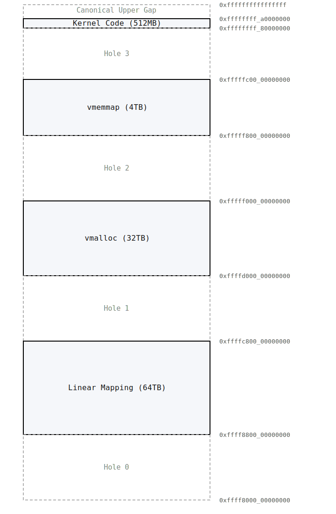

# 内核虚拟内存布局

在 32 位模式下由于虚拟地址空间相对有限，所有布局会受掣肘，而在 64 位下，虽然默认 48 位的有效虚拟地址相对 48 位的物理地址来说并不算多，但哪怕对半分之后内核和用户进程都有 128 TB 的虚拟地址空间，不管是对于共享地址空间的内核还是有独立地址空间的用户进程来说都还是非常够用的（实在不够其实还有 LA57 模式可以使用 57 位有效虚拟地址，不过那是极端情况就不考虑了）

这里大致的空间布局还是参考了 Linux，不过我还是按自己的想法调整了一下地址：

## 线性映射区

这里线性映射区并没有直接往前对齐到 `0xffff8000_00000000` ，留出了一个空洞用来发现错误的内存地址引用。线性映射区肯定也不能直接填满内核区的全部 128 TB，所以选择了一半，64TB，对于内核来说是够用了，如果需要用到没有映射到物理内存则直接使用 `vmalloc` 区创建临时映射即可

## vmalloc 区

用来创建非线性的映射，除了 `vmalloc` 还会用于 `ioremap` 等无法和物理地址线性映射的区域，共 32 TB

## vmemmap 区

在 64 位下，不能再像 32 位下一样为所有的物理页帧都留出实际的内存了，否则毫无意义的开销会变得非常大。所以我采用了 vmemmap，预留出所有需要用到的虚拟地址，但是只分配和映射实际存在的物理内存需要的元数据大小。

64 位模式下物理地址位宽为 48 位，页内偏移用掉 12 位，所以一共有 $2^{36}$ 个页。元数据大小设置为 64 字节，也就是 $2^6$ 字节。所以 vmemmap 需要 $2^{36} \times 2^6 = 2^{42}$ 字节，即 4 TB

## Kernel Code 区

内核代码放在 `Kernel Code` 区，不和线性映射区放一起，因为初始化线性映射区还是需要一点功夫的。`Kernel Code` 区大小设为 512 MB，意味着内核可执行文件大小也不能超过 512 MB （实际上算上起始偏移 `0x10000` 和早期分配需要的内存，还不到 512 MB）
