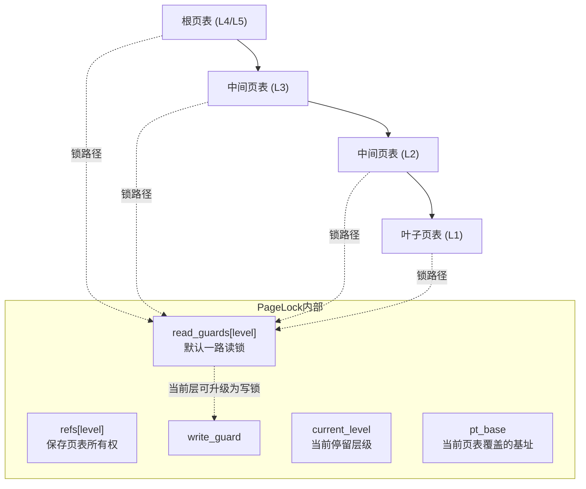
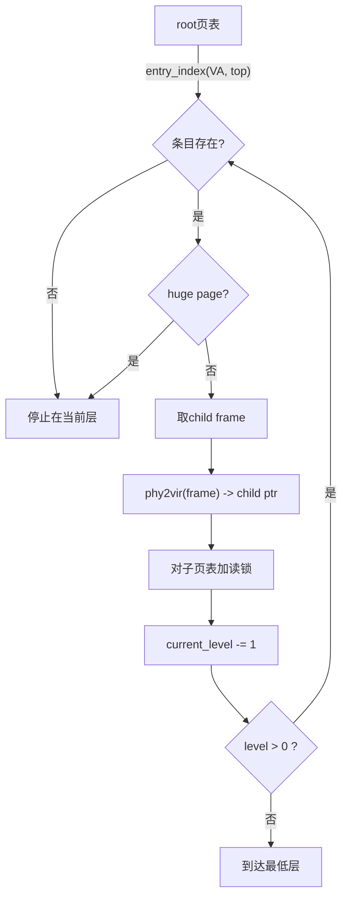
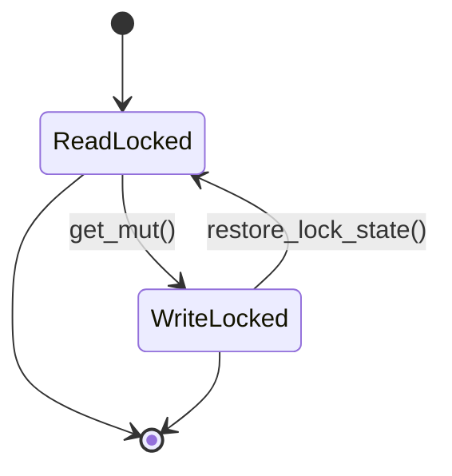
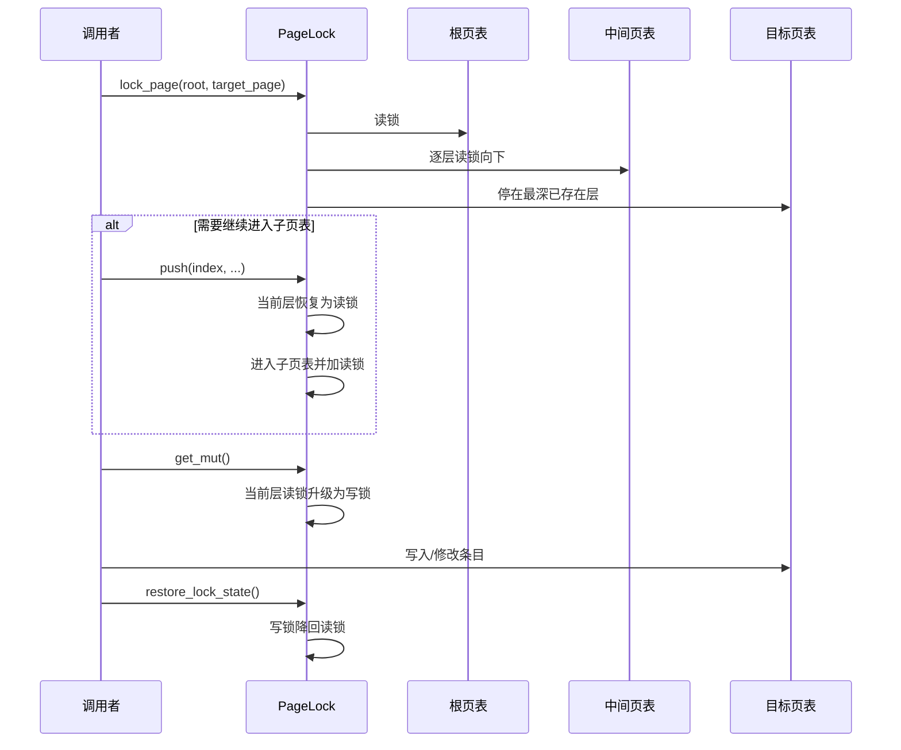

对于页表的所有操作都需要经过页锁

设计之前，首先需要明确使用到页表的所有操作

- 地址翻译：只读遍历已映射的叶子节点
- 建立&解除映射：遍历覆盖的所有叶子（空）节点，然后写入
- 创建页表：在建立映射过程中用到，可以先填完了页表再写入上层的空条目
- 删除页表：当页表下的映射都已解除时，需要解除上一级页表的映射并释放
- 扫描整个页表：只读遍历所有页表的所有条目

地址翻译、建立/解除映射、创建页表需要一个能够隐藏页表层级、默认提供不可变引用且可以转换可变引用的迭代器

扫描整个页表可以直接获取页表的引用

删除页表需要先一路锁到目标页表，然后解除这一级的锁，将上一级转换为写锁，修改条目

# 要求

## 页表页

为了能够正确将其映射移除，页表页需要位于线性映射区，因此在自动释放时可以直接通过计算得到虚拟地址。当然通过 Buddy 默认分配的页都是可以线性映射的

## 引用计数

页表页需要一个自动释放的逻辑，不能已经空了还 ”占着茅坑不拉屎“ ，每次删除条目都遍历一遍当前页表显然不现实，所以使用页元数据自带的引用计数也就很合理了。

- 页表页在分配过来初始化之后需要调用 `downgrade` 将默认的 `UniqueFrames` 转换为 `SharedFrames` ，从而允许修改引用计数来创建新的引用
- 除了在页表锁中创建和销毁引用需要修改引用计数外，页表页每新增或删除一个条目都要修改引用计数
- 对于启动早期创建的页表（包括根页表、线性映射区页表、`vmemmap` 区页表、`Kernel Code` 区页表）都额外增加一个引用计数使其不可被释放
- 在释放 `SharedFrames` 时，若计数

## 页表锁

所有的页表锁必须由 `Pagelock` 持有，需要用的时候提供临时的不可变或可变引用

锁是从上到下依次锁的，读取/修改是需要从下到上的

---

所以作为基座的 `Pagelock` 需要以下功能：

- 通过 `lock_page` 创建，基于给定的页号，将路径上的所有页都加上读锁
- `pop`：返回当前页表的共享引用所有权 `SharedFrames`，用于删除页表时给当前页表解锁，也用于迭代器切换页表
- `get_mut`：返回可变引用，如果是读锁则转换成写锁
- `get`：返回不可变引用
- `push`：接受 `index` 输入，尝试根据 index 所指向的条目加页表锁压栈

# 设计

我选择了相对细粒度的按页表页划分的读写锁而不是全局页表锁，为了使用上的方便，我需要将它封装成唯一的一个锁类型 `PageLock` , 但同时也要专门提供一些额外的方法提供灵活性满足不同类型操作的需要。

## 加锁

首先是最基础的加锁：



加锁的过程需要从根页表开始，根据调用方提供目标要锁住的页号，自动逐级往下给经过的所有页表页加读锁。使用 `read_guards` 数组保存已锁住的页表引用，可以选择将最后一层页表读锁转换成写锁。这里会有几个要求：

1. 上级页表要加读锁
   - 因为如果不锁住上级页表，其他的线程有可能直接修改掉路径上的某个页表的条目，导致出现无法预估的错误
   - 而且上层的页表不需要改变内容，通过读锁可以共享读，如果用写锁反而会退化成全局锁，失去了意义
2. 默认全部都是读锁，只有最后一级能转换为写锁
   - 默认读锁当然是最大限度的允许并发读，哪怕是建立或删除映射也需要先检查内容，所以要将写锁的临界区缩小
3. 读锁转换为写锁需要先解锁在重新加锁
   - 虽然可以检查到读锁数量为 1 时直接转换为写锁，但是其余情况还是要正常的走完整的写锁路径的
   - 这里为了源源不断的读锁，在锁上提供了 `pending` 位，写锁时设置该位就不允许新的读锁加入，所以还是要走完整路径
4. 只能根据目标页号锁到最后一层
   - 一部分是因为没有方便的方法指定锁到哪一级页表，而且如果用了大页更是不确定具体要锁到哪一级页表
   - 再一个就是绝大多数情况下，想要修改页表都是在页表为空时（刚分配或是即将释放时），实在不行就通过 `pop` 回退

## PtPage

这里使用了一个专门的类型描述页表页，保存了其可直接访问的虚拟地址指针和物理页号

```rust
pub struct PtPage<T: PageTable> {
    ptr: NonNull<T>,
    frame: FrameNumber,
}
```

除了普通的 `new` 之外，它还有个特殊方法 `from_ptr` 从虚拟地址创建

```rust
impl<T: PageTable> PtPage<T> {
    pub fn new(ptr: *const T, frame: FrameNumber) -> Self {
        Self {
            ptr: NonNull::new(ptr as *mut T).expect("page table pointer is null"),
            frame,
        }
    }

    pub fn from_ptr(ptr: *const T) -> Self {
        let addr = ptr.addr();
        assert!(
            addr >= KLINEAR_BASE.as_usize(),
            "runtime page table must be linear mapped"
        );
        let frame = PhysAddr::new(addr - KLINEAR_BASE.as_usize()).to_frame_number();
        Self::new(ptr, frame)
    }
}
```

它有个默认的前提：页表页必须位于线性映射区中

## 读写锁

整个页表锁的抽象就是有一个一个读写锁组合起来的，我这里使用了基于自旋锁的读写锁，内部细节就不展开了，讲讲外部的统一抽象：

```rust
pub trait PtRwLock<'a, T: PageTable> {
    type ReadGuard: 'a + Deref<Target = T> + Into<Self::WriteGuard>;
    type WriteGuard: 'a + Deref<Target = T> + DerefMut<Target = T> + Into<Self::ReadGuard>;
    type Table: Clone;

    fn read_lock(page: PtPage<T>) -> Self::ReadGuard;
    fn table(page: PtPage<T>) -> Option<Self::Table>;
    unsafe fn drop_table(table: &mut Self::Table) -> Option<usize>;
}
```

这里将其抽象为 trait 是由于内核启动早期锁还没初始化，这样可以让早期也能共用页表操作逻辑

### 占位的早期锁

早期的 “锁” 返回了一些伪造的数据装作自己也是一个读写锁

```rust
pub struct EarlyPtLock;

impl<'a, T: PageTable + 'a> PtRwLock<'a, T> for EarlyPtLock {
    type ReadGuard = EarlyRwPage<'a, T>;
    type WriteGuard = EarlyRwPage<'a, T>;
    type Table = ();

    fn read_lock(page: PtPage<T>) -> Self::ReadGuard {
        EarlyRwPage {
            table: page.ptr,
            _phantom: PhantomData,
        }
    }

    fn table(_: PtPage<T>) -> Option<Self::Table> {
        Some(())
    }

    unsafe fn drop_table(_: &mut Self::Table) -> Option<usize> {
        Some(1)
    }
}
```

用了同一个类型 `EarlyRwPage` 作为 `ReadGuard` 和 `WriteGuard` 

```rust
pub struct EarlyRwPage<'a, T: PageTable> {
    table: NonNull<T>,
    _phantom: PhantomData<&'a mut T>,
}

impl<'a, T: PageTable> Deref for EarlyRwPage<'a, T> {
    type Target = T;

    fn deref(&self) -> &'a Self::Target {
        unsafe { self.table.as_ref() }
    }
}

impl<'a, T: PageTable> DerefMut for EarlyRwPage<'a, T> {
    fn deref_mut(&mut self) -> &'a mut Self::Target {
        unsafe { self.table.as_mut() }
    }
}
```

### 普通锁

这才是一个正常的读写锁的封装，锁被存放在 Frame 元数据当中

```rust
pub struct NormalPtLock;

impl<'a> PtRwLock<'a, ArchPageTable> for NormalPtLock {
    type ReadGuard = RwReadGuard<'a, ArchPageTable>;
    type WriteGuard = RwWriteGuard<'a, ArchPageTable>;
    type Table = SharedFrames;

    fn read_lock(page: PtPage<ArchPageTable>) -> Self::ReadGuard {
        let frame = page.frame;
        let frame = Frame::get_raw(frame);
        unsafe {
            frame
                .as_ref()
                .get_data()
                .page_table
                .lock
                .read_lock(page.ptr)
        }
    }

    fn table(page: PtPage<ArchPageTable>) -> Option<Self::Table> {
        SharedFrames::new(Frame::get_raw(page.frame))
    }

    unsafe fn drop_table(table: &mut Self::Table) -> Option<usize> {
        table.refcount.release()
    }
}
```

正常通过 `table()` 获取页表的引用，`drop_table` 是为删除条目时减少页表页计数设计的

## PageLock

而和 `PtRwLock` 对接的，就是真正的页表锁整体抽象 `PageLock` 了

### 结构

```rust
pub struct PageLock<'a, T, Lock>
where
    T: PageTable + 'a,
    Lock: PtRwLock<'a, T>,
{
    /// 当前页表的起始页号
    pt_base: PageNumber,
    current_level: Option<usize>,

    // 引用栈
    refs: [Option<Lock::Table>; MAX_PAGE_TABLE_LEVELS],
    // 读锁栈
    read_guards: [Option<Lock::ReadGuard>; MAX_PAGE_TABLE_LEVELS],
    // 临时的写锁
    write_guard: Option<Lock::WriteGuard>,

    phy2vir: fn(FrameNumber) -> *const T,
    _phantom: PhantomData<&'a (T, Lock)>,
}
```

### 加锁

直接看结构可能比较乱，顺着加锁的逻辑可能会清晰一点




```rust
pub fn lock_page(
    root: PtPage<T>,
    page: PageNumber,
    phy2vir: fn(FrameNumber) -> *const T,
) -> Option<Self> {
    assert!(T::LEVELS <= MAX_PAGE_TABLE_LEVELS);

    let root_guard = Lock::read_lock(root);
    let root_ref = Lock::table(root)?;
    
    /// ...
}
```

首先要给根页表加锁并获取它的引用

```rust
    let top_level = T::top_level();
    let mut read_guards = [None, None, None, None, None];
    let mut refs = [None, None, None, None, None];
    read_guards[top_level] = Some(root_guard);
    refs[top_level] = Some(root_ref);
```

然后用一个手动构造的栈保存 guard 和引用

```rust
	let mut page_lock = Self {
        pt_base: page,
        current_level: Some(top_level),
        refs,
        read_guards,
        write_guard: None,
        phy2vir,
        _phantom: PhantomData,
    };
```

构造 `PageLock` 自身

```rust
	while let Some(level) = page_lock.current_level
        && level > 0
    {
        let index = T::entry_index(page, level);
        let entry = page_lock.get()?.get_entry(index).read();
        
        if !entry.is_present() || entry.is_huge(level as u8) {
            break;
        }
        // ...
	}
```

开始核心的循环，每次循环都要验证页表层级 `current_level` 是否有效，然后根据页号获取到在当前层级的索引。再根据索引读取到具体的条目。如果遇到空条目或者是大页则终止并返回，交给调用方自行处理。

```rust
        let child_level = level - 1;
        let frame = entry.frame_number()?;

        let ptr = (page_lock.phy2vir)(frame);
        let child_page = PtPage::new(ptr, frame);
```

如果存在，那就要获取下一级页表的相关信息来继续深入了。这里使用外部传入的 `phy2vir` 来将条目中的物理地址转换为虚拟地址，然后创建 `PtPage`

```rust
		let guard = Lock::read_lock(child_page);
        let frame = Lock::table(child_page)?;

        page_lock.refs[child_level] = Some(frame);
        page_lock.read_guards[child_level] = Some(guard);
        page_lock.current_level = Some(child_level);
```

将下一级页表的 guard 和引用都保存到自己构建的栈中，继续循环

```rust
	let pt_base = page_lock.pt_base.get() & T::LEVEL_MASKS[page_lock.current_level? + 1];
    page_lock.pt_base = PageNumber::new(pt_base);

    Some(page_lock)
```

在循环结束之后，先重新计算一下当前页表所指向的虚拟地址起点，然后返回

### 工具函数

`PageLock` 还提供了一些接口来获取当前的状态和目前锁住的页表的引用

```rust
pub const fn level(&self) -> Option<usize> {
    self.current_level
}

pub const fn base(&self) -> PageNumber {
    self.pt_base
}

pub fn get(&self) -> Option<&T> {
    self.write_guard.as_deref().or_else(|| {
        let level = self.current_level?;
        self.read_guards[level].as_deref()
    })
}

pub fn get_mut(&mut self) -> Option<&mut T> {
    let level = self.current_level?;

    if self.write_guard.is_none() {
        let read_guard = self.read_guards[level].take()?;
        self.write_guard = Some(read_guard.into());
    }

    self.write_guard.as_deref_mut()
}

pub fn restore_lock_state(&mut self) {
    let Some(level) = self.current_level else {
        return;
    };
    let Some(write_guard) = self.write_guard.take() else {
        return;
    };

    self.read_guards[level] = Some(write_guard.into());
}
```

无论是读锁还是写锁都可以通过 `get` 直接获取到不可变引用，对于读锁， `get_mut` 需要将读锁重新加锁为写锁后再返回写锁的可变引用。

不管当前是读锁还是写锁，通过 `restore_lcok_state` 都可以恢复到读锁状态，以便继续遍历




```rust
/// 克隆当前页表页引用
pub fn clone_current(&self) -> Option<Lock::Table> {
    let level = self.current_level?;
    self.refs[level].clone()
}

/// 减少当前页表页引用计数，返回剩余引用计数
///
/// # Safety
///
/// 需要自行确保增加和释放对称
pub unsafe fn drop_current(&mut self) -> Option<usize> {
    let level = self.current_level?;
    unsafe { Lock::drop_table(self.refs[level].as_mut()?) }
}
```

这两个函数用来辅助管理页表页的生命周期

#### 栈

**push**

根据索引进入当前页表下的某个页表

```rust
/// 进入子页表
///
/// `new_table` 用于传入新创建的页表引用，如果为 `None` 则自动创建
pub fn push(&mut self, index: usize, new_table: Option<Lock::Table>) -> Option<()> {
    let level = self.current_level?;
    if level == 0 {
        return None;
    }

    self.restore_lock_state();

    let entry = self.get()?.get_entry(index).read();

    let frame_number = entry.frame_number()?;

    if entry.is_huge(level as u8) {
        return None;
    }

    let child_level = level - 1;
    let child_page = PtPage::new((self.phy2vir)(frame_number), frame_number);

    assert!(
        self.read_guards[child_level].is_none(),
        "page lock stack corruption: child level already occupied"
    );

    let mut target_page = self.pt_base.get();
    target_page &= T::LEVEL_MASKS[level + 1];
    target_page |= index << T::LEVEL_SHIFTS[level];
    self.pt_base = PageNumber::new(target_page);

    let table = new_table.or_else(|| Lock::table(child_page));
    self.refs[child_level] = table;
    self.read_guards[child_level] = Some(Lock::read_lock(child_page));
    self.current_level = Some(child_level);

    Some(())
}
```

和 `lock_page` 里的逻辑差不多，不解释了

**pop**

```rust
/// 退出当前页表
pub fn pop(&mut self) -> Option<(Lock::Table, usize)> {
    let level = self.current_level?;

    if self.write_guard.is_some() {
        self.write_guard.take().map(drop)
    } else {
        self.read_guards[level].take().map(drop)
    }?;

    if level == T::top_level() {
        self.current_level = None;
    } else {
        self.current_level = Some(level + 1);
        self.pt_base = PageNumber::new(self.pt_base.get() & T::LEVEL_MASKS[level + 2]);
    }

    self.refs[level].take().zip(self.current_level)
}
```

弹出当前页表，回到父页表下。同时会返回当前页表页的引用，相当于交给调用方处理页表页的生命周期

### 释放

由于锁的释放也是有顺序要求的，所以需要自己实现 `Drop` 

```rust
impl<'a, T, Lock> Drop for PageLock<'a, T, Lock>
where
    T: PageTable + 'a,
    Lock: PtRwLock<'a, T>,
{
    fn drop(&mut self) {
        let _ = self.write_guard.take();

        let start = self.current_level.unwrap_or(0);
        for level in start..self.read_guards.len() {
            let _ = self.read_guards[level].take();
        }
    }
}
```

# 应用流程示例



当然，后面的页表迭代器也是一个比较简单且用的多的示例
