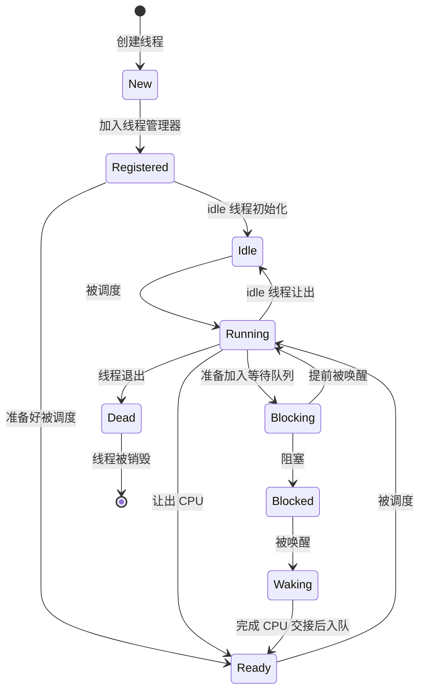

# 基础信息

## Thread

我选择了 `Thread` 作为调度的基本单位而不是像 `Linux` 一样用 `task` ，这样比较便于理解

首先需要定义一个线程的基础信息，后期根据需要可以扩展：

- 唯一标识符即线程 ID （不需要完全唯一，只需要线程列表里面没有重复的就行）
- 线程名字
- 线程状态

就这么简单，其他的像线程上下文什么的就先忽略不计了，所以定义如下：

```rust
pub struct Thread {
    id: ThreadId,
    name: &'static CStr,
    
    // ...
    
    inner: Spinlock<ThreadInner>,
}

pub struct ThreadInner {
    state: ThreadState,
}

```

`Thread` 以不可变引用的形式传递，将内部可变的部分放到 `ThreadInner` 里面用自旋锁保护起来

## ThreadId

`ThreadId` 非常简单，就是将 `usize` 封装起来，从一个全局的计数器获取新 id

```rust
static NEXT_THREAD_ID: AtomicUsize = AtomicUsize::new(0);

#[derive(Clone, Copy, PartialEq, Eq)]
#[repr(transparent)]
pub struct ThreadId(usize);

impl ThreadId {
    fn new() -> Self {
        Self(NEXT_THREAD_ID.fetch_add(1, Ordering::Relaxed))
    }
}
```

全局的 id 计数器是原子类型， 从 0 开始，线程 0 是内核手动构造的 `main` 线程，完成初始化之后就会自己退出

## ThreadState

目前为止，需要用到的线程状态类型如下：

```rust
#[derive(Debug, Clone, Copy, PartialEq, Eq)]
pub enum ThreadState {
    New,
    Registered,
    Idle,
    Ready,
    Running,
    Blocking,
    Blocked,
    Waking,
    Dead,
}
```

状态切换必须交给 `ThreadInner::transition_to()` 来校验并完成，防止出现非法状态切换

### 状态转移图



# 管理结构

## Thread

首先一个线程肯定是通过链表被调度器管理的，所以需要一个 `ListNode<Thread>` 

对于用来阻塞线程的等待队列，一个线程同时只能被一个线程阻塞，所以需要一个 `Waiter` 用来等待

为了实现 `join` 功能，每个线程都必须有一个专门用于 `join` 的等待队列 `WaitQueue` ，由于使用了侵入式链表所以是 `!Unpin` 的，不能移动，但 `Thread` 自身本来也有使用 `ListNode` 所以也就不影响了

每个线程还需要有自己的上下文信息以便保存和恢复，对于 x86 来说只需要保存栈指针就好，在上下文切换时将信息压入和弹出栈并更新这个栈指针

然后是保存线程使用的栈的所有权，以页为单位将 `Pages` 封装为 `KernelStack`

完整的定义如下：

```rust
struct Thread {
    // ...
    
    run_node: SyncUnsafeCell<ListNode<Thread>>,
    thread_node: SyncUnsafeCell<ListNode<Thread>>,
    waiter: Waiter,
    join_waiters: WaitQueue,
    on_cpu: AtomicBool,

    // context 只能由持有调度器全局锁且禁止抢占的代码修改，不能通过普通
    // Thread API 取得可变引用。
    context: SyncUnsafeCell<ArchThreadContext>,

    // 栈所有权与 context 分开保存；context 中的 rsp 始终指向这块内存。
    _kernel_stack: KernelStack,
    
    // ...
}
```

## Context

线程上下文是会因为架构而不一样的，所以通过 trait 来定义统一接口

```rust
/// 架构层必须提供的最小线程上下文接口。
///
/// 寄存器布局、初始 switch frame 和 trampoline 均由架构实现私有管理。线程核心
/// 只提供一段已分配的内核栈，并保存返回的 opaque context。
pub trait ThreadContext: Sized {
    /// 在 `stack_bottom..stack_bottom + stack_size` 中构造新内核线程的初始帧。
    ///
    /// # Safety
    ///
    /// 栈范围必须独占、可写，并且至少在线程对象存活期间保持有效。
    unsafe fn new_kernel(
        stack: &mut KernelStack,
        entry: KernelThreadEntry,
        argument: *mut c_void,
    ) -> Self;

    /// 保存当前上下文并恢复 `next`。
    ///
    /// # Safety
    ///
    /// 当前 CPU 必须独占两个上下文，且满足架构切换所需的中断和抢占约束。
    unsafe fn switch_to(&mut self, next: &Self);

    /// 为第一个线程构造初始上下文。
    ///
    /// # Safety
    ///
    /// 只能在构造第一个线程时使用，否则会破坏当前线程的上下文
    unsafe fn prepare_first_thread(context: &Self);
}
```


# 使用

## 创建

目前的设计仅限于内核线程，可以直接通过 `Thread::new_kernel` 来创建一个内核线程的描述结构。这里创建的结构还不能够被调度，需要之后手动加入线程管理器并由其交给调度器才能够真正运行

```rust
/// 分配一个尚未注册、不可调度的内核线程。
pub fn new_kernel(
    name: &'static CStr,
    entry: KernelThreadEntry,
    argument: *mut c_void,
) -> Result<Self, MemoryError> {
    let mut stack = KernelStack::new()?;
    let context = unsafe { ArchThreadContext::new_kernel(&mut stack, entry, argument) };

    Ok(Self {
        id: ThreadId::new(),
        name,
        run_node: SyncUnsafeCell::new(ListNode::new()),
        waiter: Waiter::new(),
        thread_node: SyncUnsafeCell::new(ListNode::new()),
        join_waiters: WaitQueue::new_uninit(),
        on_cpu: AtomicBool::new(false),
        context: SyncUnsafeCell::new(context),
        _kernel_stack: stack,
        inner: Spinlock::new(ThreadInner::new()),
    })
}
```

`KernelStack::new` 根据所需的栈大小分配页，`ArchThreadContext::new_kernel` 创建一个初始上下文

## 构建第一个线程

在内核启动后，需要构建第一个线程才能接入线程管理的正轨

```rust
pub(in super::super) fn prepare_first_thread(thread: &Self) {
    let context = unsafe { &*thread.context.get() };

    thread.transition_to(ThreadState::Running).unwrap();
    unsafe { ArchThreadContext::prepare_first_thread(context) };
}
```

将其直接设置为正在运行的状态，不需要经过调度器

## 初始化

由于 `WaitQueue` 当中使用的链表头是需要初始化的，为了防止漏掉，初始化函数由线程管理器来调用

```rust
pub(in super::super) fn init(&self) {
    self.join_waiters.init();
}
```

## join

`join` 用来等待另一个线程退出，使用方法是 `target.join()` ，内部能自己获取到当前线程的信息

```rust
/// 等待该线程退出
///
/// 线程退出是永久状态，因此允许多个持有者同时或先后等待。调用方必须持有
/// 保证 `self` 在本次调用期间存活的强引用
pub fn join(&self) {
    assert!(in_thread(), "Thread::join outside thread context");

    let scheduler = scheduler();
    let current = scheduler.current();

    assert!(!ptr::eq(current, self), "thread cannot join itself");
    assert!(!scheduler.is_idle(self), "idle thread cannot be joined");
    assert!(
        scheduler.can_preempt(),
        "Thread::join while preemption is disabled"
    );

    let condition = JoinCondition { thread: self };
    let _ = self.join_waiters.wait(&condition);
}
```

## 准备退出

只能由即将退出的线程自己调用，是线程退出流程中由线程自行处理的一部分

```rust
/// 发布永久退出状态并唤醒所有 joiner
///
/// # Safety
///
/// 必须已经关闭中断并持有可切换的 PreemptGuard，但不能持有 ready queue 锁，
/// 因为唤醒 Blocked joiner 需要重新获取该锁
///
/// 必须由即将退出的线程调用
pub(in super::super) unsafe fn finish(&self) {
    assert!(
        ptr::eq(scheduler().current(), self),
        "Thread::finish must be called by the exiting thread"
    );
    self.transition_to(ThreadState::Dead)
        .expect("running thread must transition to Dead");
    self.join_waiters.wake_all();
}
```

## 辅助函数

```rust
pub const fn id(&self) -> ThreadId {
    self.id
}

pub const fn name(&self) -> &'static CStr {
    self.name
}

pub fn state(&self) -> ThreadState {
    self.inner.lock().state
}

pub(in super::super) fn transition_to(
    &self,
    new_state: ThreadState,
) -> Result<(), ThreadError> {
    self.inner.lock().transition_to(new_state)
}

/// 获取线程在调度器就绪队列中的节点。仅供调度器在禁止抢占并独占上下文时调用。
///
/// # Safety
///
/// 该线程必须已经被 ThreadManager 注册
pub(in super::super) unsafe fn get_run_node(&self) -> &mut ListNode<Thread> {
    unsafe { &mut *self.run_node.get() }
}

pub(in super::super) const fn run_node_offset() -> usize {
    offset_of!(Thread, run_node)
}

pub(in super::super) const fn waiter(&self) -> &Waiter {
    &self.waiter
}

/// 从内嵌的 Waiter 恢复所属线程。
///
/// # Safety
///
/// `waiter` 必须指向一个仍然存活的 Thread 的 `waiter` 字段。
pub(in super::super) unsafe fn from_waiter(waiter: NonNull<Waiter>) -> NonNull<Self> {
    container_of!(waiter, Thread, waiter)
}
```
